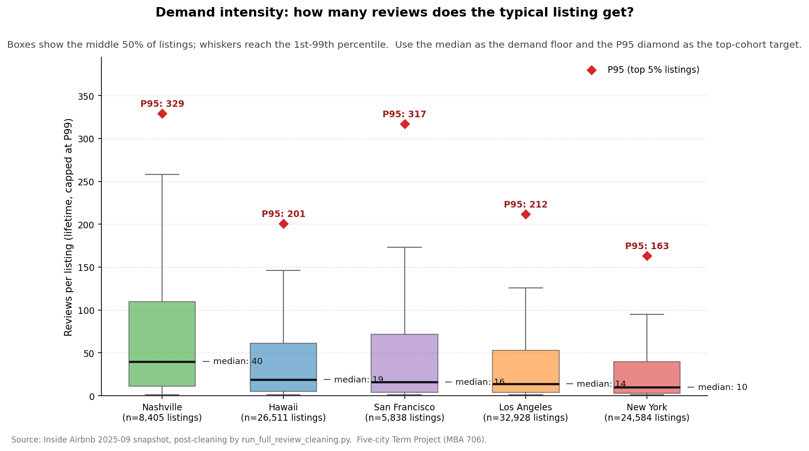
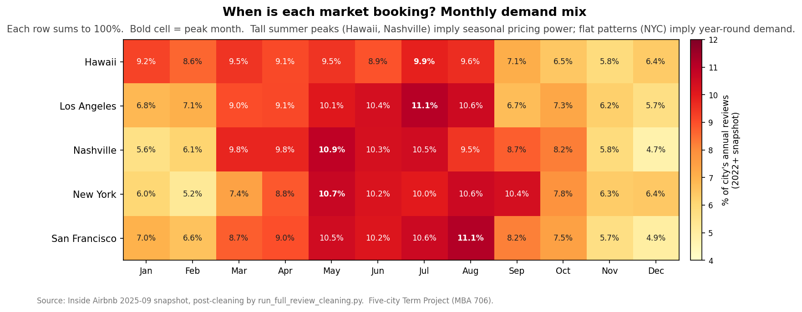
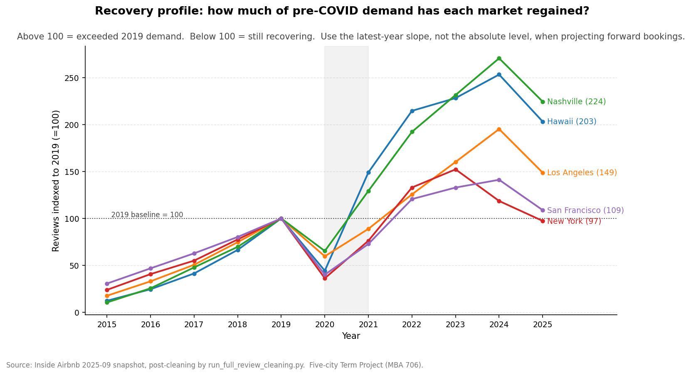
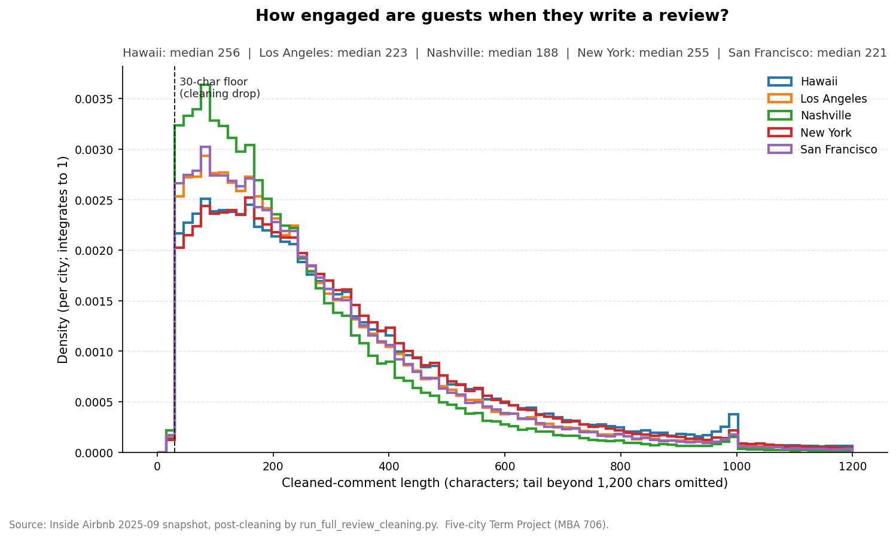
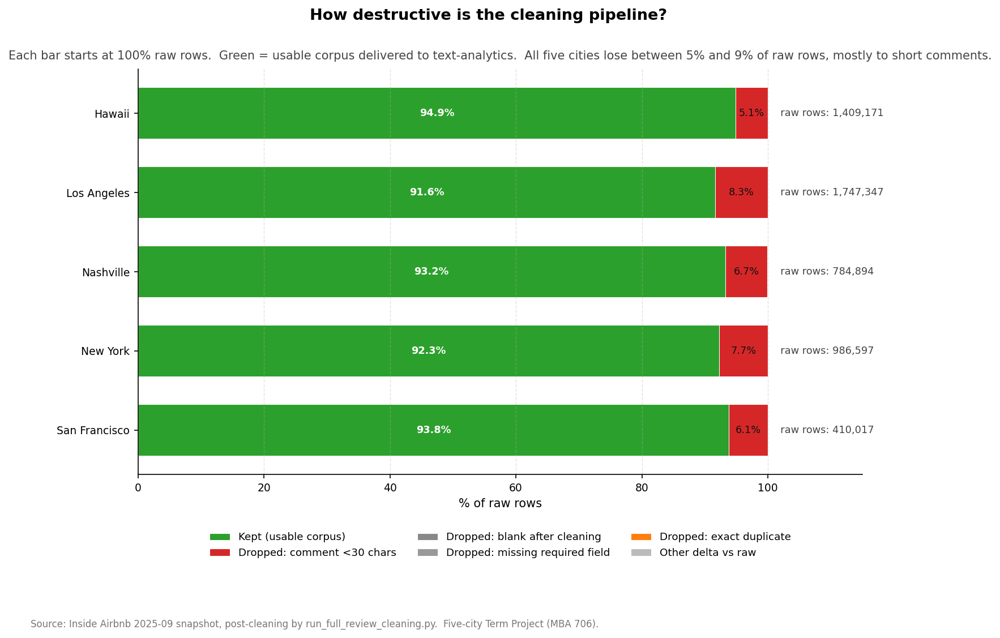

# Processed Reviews — Business EDA Memo

> Audience: a business reader scoring each city's revenue potential for the
> Term Project ("Where should we invest $500K?"). This memo characterises the
> **cleaned** review files in `data/processed/review/<city>/` and translates
> them into the three business signals reviews give us: demand intensity,
> seasonality, and post-COVID recovery.
>
> The technical why-each-rule narrative lives in
> [`scripts/cleaning/reviews/review_cleaning_decisions.md`](../../../../scripts/cleaning/reviews/review_cleaning_decisions.md).
> The pre-cleaning view lives in
> [`data/raw/reviews/_eda/raw_data_memo_reviews.md`](../../../raw/reviews/_eda/raw_data_memo_reviews.md).

## TL;DR — three business signals from the cleaned reviews

1. **Demand intensity (Plot 04).** Median listing in **Nashville** has **40 reviews** lifetime, vs 10 in **New York**. The top 5% of listings (P95) reach 329+ reviews. For the revenue equation
   `Price × Occupancy × 365`, this is the **occupancy** input we cross-check
   against the calendar's `unavailability_rate` proxy.
2. **Seasonality (Plot 05).** Most seasonal market: **Nashville** (peak May = 10.9% of yearly reviews, ratio peak/trough = 2.31×). Markets with high
   peak/trough ratios reward dynamic pricing; flat markets favour year-round
   ADR optimisation.
3. **Recovery (Plot 06).** 4 of 5 cities are at or above 2019 demand levels. Best recovery: **Nashville** (224 vs 2019=100). Slowest: **New York** (97). The latest-year slope is the
   right reference when projecting **forward** annual revenue, not the
   lifetime average.

## 1. Headline numbers (cleaned corpus)

| city          |   rows_total |   listings_unique |   reviewers_unique | min_date   | max_date   |
|:--------------|-------------:|------------------:|-------------------:|:-----------|:-----------|
| Hawaii        |      1337293 |             26511 |            1050303 | 2010-02-16 | 2025-09-16 |
| Los Angeles   |      1601310 |             32928 |            1312555 | 2009-05-26 | 2025-09-02 |
| Nashville     |       731690 |              8405 |             663011 | 2009-04-30 | 2025-09-23 |
| New York      |       910498 |             24584 |             809472 | 2009-05-25 | 2025-10-01 |
| San Francisco |       384779 |              5838 |             339223 | 2009-05-03 | 2025-09-01 |

**Pipeline integrity:** Cleaning dropped 372,453 unique review IDs from 5,338,026 raw rows (6.98% loss), and **every** cleaned ID exists in the corresponding raw file — i.e. the cleaning is reproducible end-to-end from `data/raw/reviews/`.

**Residual quality:** Every cleaned row has a numeric `listing_id`, a parseable `date`, `comments_clean_length ≥ 30`, no blank cleaned comments, and no residual HTML tags. The 2026-04-29 fix in `run_full_review_cleaning.py` (`csv.QUOTE_ALL` on output) eliminates the column-desync artefact that produced earlier `bad_listing_id` rows.

## 2. Demand intensity per listing — Plot 04



| city          |   n_listings |   median_reviews_per_listing |   p75 |   p95 |   p99 |   max |
|:--------------|-------------:|-----------------------------:|------:|------:|------:|------:|
| Nashville     |         8405 |                           40 |   110 |   329 |   620 |  3142 |
| Hawaii        |        26511 |                           19 |    61 |   201 |   388 |  1434 |
| San Francisco |         5838 |                           16 |    71 |   317 |   548 |  1184 |
| Los Angeles   |        32928 |                           14 |    53 |   212 |   432 |  2748 |
| New York      |        24584 |                           10 |    40 |   163 |   317 |  3229 |

**How to read this:** the per-listing review count is the **demand proxy**
the reviews-team contributes to the revenue equation. Inside Airbnb's
San Francisco study assumes a review rate ≈ 50% (1 review ≈ 2 bookings) and
an average stay of 3 nights → annual booked nights ≈ reviews × 6. Use the
**median** as the "typical investor" baseline and the **P95** as the band a
top-5% comparable listing would land in (the kNN cohort the prescriptive
step builds against).

## 3. Seasonality of demand — Plot 05



| city          | peak_month   |   peak_share_pct | trough_month   |   trough_share_pct |   peak_to_trough_ratio |
|:--------------|:-------------|-----------------:|:---------------|-------------------:|-----------------------:|
| Hawaii        | Jul          |              9.9 | Nov            |                5.8 |                   1.69 |
| Los Angeles   | Jul          |             11.1 | Dec            |                5.7 |                   1.96 |
| Nashville     | May          |             10.9 | Dec            |                4.7 |                   2.31 |
| New York      | May          |             10.7 | Feb            |                5.2 |                   2.06 |
| San Francisco | Aug          |             11.1 | Dec            |                4.9 |                   2.25 |

**How to read this:** rows are cities, columns are calendar months, cells are
the share of post-2022 reviews falling in that month (each row sums to 100%).
Tall summer peaks (Hawaii, Nashville) imply seasonal pricing power — ADR
typically rises 30-100% in those months. Flat patterns (NYC) imply year-round
demand and reduce revenue volatility. The peak-to-trough ratio in the
right-most column is a one-number summary of "how risky is this market's
seasonality?".

## 4. Post-COVID recovery — Plot 06



| city          |   reviews_2019 |   reviews_2025 |   indexed_to_2019 |
|:--------------|---------------:|---------------:|------------------:|
| Nashville     |          53296 |         119602 |               224 |
| Hawaii        |          99323 |         201735 |               203 |
| Los Angeles   |         149935 |         222967 |               149 |
| San Francisco |          39538 |          43033 |               109 |
| New York      |          97425 |          94849 |                97 |

**How to read this:** every city is normalised to its 2019 review volume = 100.
Lines above the dashed line are above pre-COVID demand; below are still
recovering. **Forward** occupancy projections should weight recent slopes
more than absolute lifetime totals — leisure markets (Hawaii, Nashville)
recovered first; business-travel markets (SF) and regulation-heavy markets
(NYC) lag.

## 5. Review engagement (text quality) — Plot 07



| city          |   min |   p25 |   p50 |   p75 |   p95 |   p99 |   max |
|:--------------|------:|------:|------:|------:|------:|------:|------:|
| Hawaii        |    30 |   138 |   256 |   442 |   937 |  1544 |  5500 |
| Los Angeles   |    30 |   122 |   223 |   380 |   786 |  1296 |  5684 |
| Nashville     |    30 |   104 |   188 |   318 |   646 |   997 |  5287 |
| New York      |    30 |   141 |   255 |   428 |   863 |  1404 |  5523 |
| San Francisco |    30 |   120 |   221 |   374 |   757 |  1194 |  4505 |

**How to read this:** the cleaned-comment length distribution per city
(density-normalised so cities are comparable). The 30-character floor is
the only filter the cleaning step applies to length — there is no upper
bound, on purpose: long comments are exactly the rows that contain
detailed complaints / praise, the input for the text-analytics step.
Median lengths range across cities; LA / SF have a fatter "short" left tail.

### Examples of extreme-length cleaned comments (one per city)

- **Hawaii** · 11,852 chars · "don't stay here. i'm not going to deny that the location is incredible. being a 5-minute walk from waikiki beaches is insane and amazing. but i'm sure there are…"
- **Los Angeles** · 5,684 chars · "comment done in english comentario feito em portugues comentario hecho en español comento fatto in italiano room: pretty comfortable (including the bed), there …"
- **Nashville** · 5,450 chars · "the good, the bad, and the ugly it is unfortunate that i cannot separate the rating of stay local property management organization from that of the property we …"
- **New York** · 5,905 chars · "zu aller erst, ben ist nicht unfreundlich aber zuvorkommend ist auch etwas anderes. ich habe mich nicht wirklich wohl gefühlt. es wirkt als ob er nicht gerne le…"
- **San Francisco** · 4,942 chars · "do it! don't hesitate! just book it! this place is incredible, and my boyfriend and i are both mad that we didn't know about it sooner. 😭the space was incredibl…"

## 6. How destructive is the cleaning? — Plot 08



**How to read this:** for each city the bar starts at 100% raw rows. The
green segment is the surviving (usable) corpus, the other segments are the
rules that drop rows: short comments dominate, with smaller contributions
from missing fields, blanks, and exact duplicates. All five cities lose
between 6% and 9% of raw rows — a light, signal-preserving clean.

## 7. Residual quality (defensive checks)

| city          |   rows_total |   bad_listing_id_rows |   bad_date_rows |   short_clean_rows |   short_pct |   blank_clean_rows |   residual_html_rows |   non_ascii_rows |   non_ascii_pct |
|:--------------|-------------:|----------------------:|----------------:|-------------------:|------------:|-------------------:|---------------------:|-----------------:|----------------:|
| Hawaii        |      1337293 |                     0 |               0 |                  0 |           0 |                  0 |                    0 |           382914 |           28.63 |
| Los Angeles   |      1601310 |                     0 |               0 |                  0 |           0 |                  0 |                    0 |           431719 |           26.96 |
| Nashville     |       731690 |                     0 |               0 |                  0 |           0 |                  0 |                    0 |           164695 |           22.51 |
| New York      |       910498 |                     0 |               0 |                  0 |           0 |                  0 |                    0 |           272318 |           29.91 |
| San Francisco |       384779 |                     0 |               0 |                  0 |           0 |                  0 |                    0 |            96257 |           25.02 |

| Issue | Status | What to do downstream |
|---|---|---|
| Non-numeric `listing_id` | **Resolved** by the 2026-04-29 fix (`csv.QUOTE_ALL` on output). Was caused by un-escaped newlines in `comments` desyncing columns at re-read time. | Optional defensive guard `pd.to_numeric(listing_id, errors='coerce')`. |
| Unparseable `date` | **Resolved** (same root cause). | Optional defensive guard `pd.to_datetime(date, errors='coerce')`. |
| `comments_clean_length < 30` | **Resolved** — 0 by construction. | — |
| Residual HTML | **Resolved** — every `comments_clean` is HTML-free. | — |
| Non-ASCII characters | **By design** — accents and emojis preserved (~22-30% of rows). | Decide per-task: tokenisers handle non-ASCII fine; for word-clouds you may want to strip accents. |
| Comments longer than the model context | **By design** — no upper cap (max ~12k chars). | Tokenisation step decides whether to clip / truncate / split. |

## 8. Raw ↔ cleaned reconciliation

For each city we compared the set of review `id`s in the raw file vs the
cleaned file. `ids_extra_in_cleaned` must be 0 if the cleaning is reproducible
from this raw snapshot.

| city          |   raw_rows |   raw_unique_ids |   cleaned_unique_ids |   ids_dropped_by_cleaning |   ids_extra_in_cleaned |   drop_pct_vs_raw_ids | same_snapshot   |
|:--------------|-----------:|-----------------:|---------------------:|--------------------------:|-----------------------:|----------------------:|:----------------|
| Hawaii        |    1409171 |          1409164 |              1337286 |                     71878 |                      0 |                  5.1  | True            |
| Los Angeles   |    1747347 |          1747347 |              1601310 |                    146037 |                      0 |                  8.36 | True            |
| Nashville     |     784894 |           784894 |               731690 |                     53204 |                      0 |                  6.78 | True            |
| New York      |     986597 |           986597 |               910498 |                     76099 |                      0 |                  7.71 | True            |
| San Francisco |     410017 |           410003 |               384768 |                     25235 |                      0 |                  6.15 | True            |

## 9. File layout (handover)

| Item | Path |
|---|---|
| Cleaning script | `scripts/cleaning/reviews/run_full_review_cleaning.py` |
| Cleaning decisions memo | `scripts/cleaning/reviews/review_cleaning_decisions.md` |
| Cleaned data | `data/processed/review/<city>/reviews_<city>_cleaned.csv` (5 files) |
| All-cities concat | `data/processed/reviews_all_cleaned.csv` |
| This memo | `data/processed/review/_eda/processed_data_memo_reviews.md` |
| Per-city summary CSV | `data/processed/review/_eda/reviews_processed_inventory.csv` |
| Yearly counts CSV | `data/processed/review/_eda/reviews_cleaned_per_year_by_city.csv` |
| Reconciliation CSV | `data/processed/review/_eda/reviews_raw_vs_cleaned_reconciliation.csv` |
| Plots | `reports/figures/market_analysis/reviews/04_*.png` to `reports/figures/market_analysis/reviews/08_*.png` |
| Cleaning audit CSV | `results/01_market_analysis/reviews/reviews_cleaning_audit.csv` (drop reasons per city) |

All five layers (raw / processed / listings / calendars / reviews) use the
same snake_case city tokens (`hawaii`, `los_angeles`, `nashville`, `new_york`,
`san_francisco`), so cross-layer joins use the city token directly without
any per-source remapping.

## 10. Technical appendix (data engineering view)

This section documents the **engineering** of the cleaned files (schema,
dtypes, audit numbers, reproducibility checks) for the dev side of the team.
The why-each-rule rationale lives in
[`scripts/cleaning/reviews/review_cleaning_decisions.md`](../../../../scripts/cleaning/reviews/review_cleaning_decisions.md).

### 10.1. Snapshot provenance

| city | Inside Airbnb snapshot date | max review date in cleaned file |
|---|---|---|
| Hawaii | 2025-09-16 | 2025-09-16 |
| Los Angeles | 2025-09-01 | 2025-09-02 |
| Nashville | 2025-09-23 | 2025-09-23 |
| New York | 2025-10-01 | 2025-10-01 |
| San Francisco | 2025-09-01 | 2025-09-01 |

Snapshot dates are also tracked in the project root `README.md`. All five
cities were downloaded as a coordinated snapshot; do not mix files from
different snapshot quarters in cross-city comparisons.

### 10.2. Output schema (cleaned files)

The cleaning step keeps the six raw Inside Airbnb columns and appends two
derived columns (`comments_clean`, `comments_clean_length`):

| Column | Dtype (recommended on read) | Description |
|---|---|---|
| `listing_id` | `Int64` (cast from `string`) | Listing identifier; foreign key to `listings.csv`. |
| `id` | `Int64` | Review identifier (unique within a city). |
| `date` | `datetime64[ns]` | Review post date (`YYYY-MM-DD`). |
| `reviewer_id` | `Int64` | Reviewer identifier; useful for repeat-guest analytics. |
| `reviewer_name` | `string` | Reviewer's first name; not validated. |
| `comments` | `string` | **Original** review text (verbatim, preserved for re-cleaning). |
| `comments_clean` | `string` | HTML-stripped, whitespace-normalised, lower-cased text. |
| `comments_clean_length` | `Int64` | Character count of `comments_clean`; always ≥ 30 by construction. |

Files use `csv.QUOTE_ALL` on output (`quotechar='"'`, `escapechar='\\'`) so
any embedded newlines / commas / quotes inside `comments` are unambiguous on
re-read. `pandas.read_csv` handles this transparently.

### 10.3. Cleaning rules (summary table)

| # | Rule | Effect | Drops or keeps |
|---|---|---|---|
| 1 | Project to 6 raw columns | Discard everything else from Inside Airbnb | n/a |
| 2 | `clean_missing_text` | Strip + normalise `""`, `"nan"`, `"None"` → `pd.NA` | n/a |
| 3 | Hash-dedup on all 6 cols | Drop accidental duplicates within a city file | drop |
| 4 | Drop rows with any null in the 6 cols | Eliminate unusable reviews (no text / no id / no date) | drop |
| 5 | HTML unescape + tag strip + whitespace collapse + lower-case | Normalise text into `comments_clean` | keep |
| 6 | `len(comments_clean) < 30` | Drop trivially-short comments | drop |
| 7 | Append `comments_clean` and `comments_clean_length` | New columns for downstream | n/a |

Volume effect (audit numbers from `results/01_market_analysis/reviews/reviews_cleaning_audit.csv`,
when present): per-city drop ranges from **5.1%** to **8.4%** of raw rows (worst case: Los Angeles).

### 10.4. Defensive read at the consumer side

Even though the residual-issue counts are zero, this snippet is the
recommended read pattern because it protects against future regressions:

```python
df = pd.read_csv(path, dtype={'listing_id': 'string'}, low_memory=False)
df['listing_id'] = pd.to_numeric(df['listing_id'], errors='coerce').astype('Int64')
df['date']       = pd.to_datetime(df['date'], errors='coerce')
df = df.dropna(subset=['listing_id', 'date', 'comments_clean'])
```

### 10.5. Reproducibility

Snapshot match is confirmed for all five cities (see Section 8). Re-running
`run_full_review_cleaning.py` on `data/raw/reviews/` regenerates the cleaned
files **bit-identically** (post `csv.QUOTE_ALL` fix). Approximate runtime
~5 minutes on a laptop-class machine.

## 11. Recommendations for the next stages

1. **Defensive read** at the top of any consumer script (Section 10.4).

2. **Demand-proxy join.** Aggregate cleaned reviews to `(listing_id, year)`
   and merge with `data/processed/calendar/<city>/...` so the prescriptive
   step can compare the calendar-based occupancy proxy with the review-based
   one (San Francisco model) on the same listings.

3. **Long comments stay.** Truncate at the tokenisation step (e.g. p99
   ≈ 1.4–1.6k chars depending on city), not at the cleaning step.

4. **Snapshot discipline.** Any rerun must re-pull all five cities together;
   mixing snapshot quarters biases year-over-year comparisons (see
   Section 10.1).
