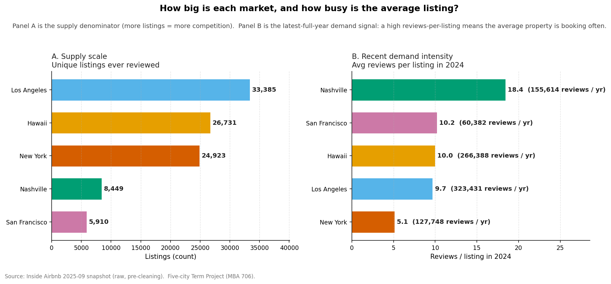
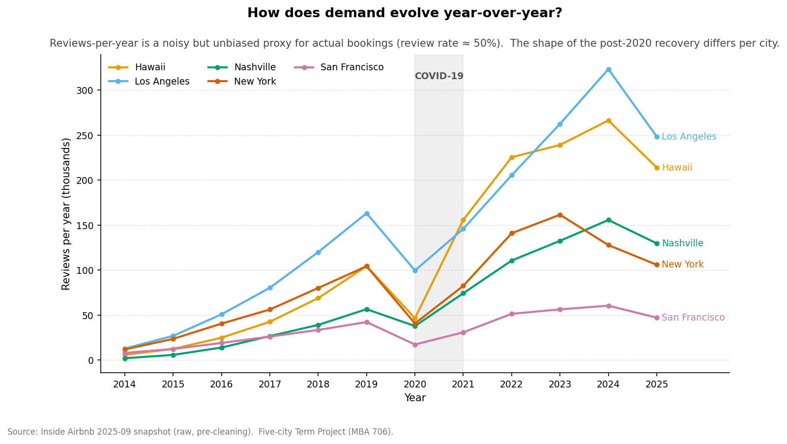
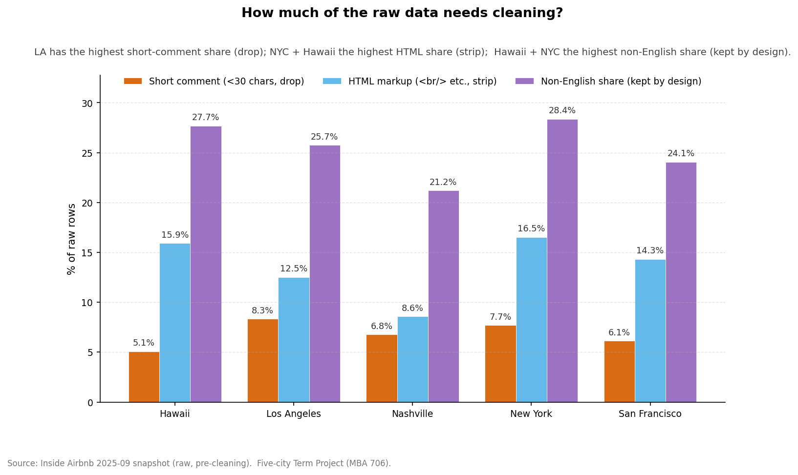

# Raw Reviews — Business EDA Memo

> Audience: a business reader sizing each city's Airbnb market for the Term Project ("Where should we invest $500K?").  This memo characterises the **raw** review files in `data/raw/reviews/` so that any later analysis (demand proxy, sentiment, topic modeling) starts from a well-understood dataset.  Detailed per-rule cleaning rationale lives in [`scripts/cleaning/reviews/review_cleaning_decisions.md`](../../../scripts/cleaning/reviews/review_cleaning_decisions.md).

## TL;DR — three things to remember

1. **Scale.** 5.34M raw reviews across the five cities, covering 99,398 unique listings (≈ 54 reviews per listing on average over the listing's lifetime). The biggest market by review volume is **Los Angeles** (1.75M); the smallest is **San Francisco** (0.41M). Snapshot covers up to **2025-10-01**.
2. **Recent demand intensity.** In the last full year (2024), the average **Nashville** listing received **18.4 reviews**, vs **5.1** in **New York** (Plot 01, Panel B). At a 50% review-rate, that translates roughly into 37 bookings vs 10 bookings per listing per year — the gap matters for the occupancy input of the revenue equation.
3. **Cleaning is light, not destructive.** ~6–8% of rows per city are dropped (mostly short or duplicate comments). HTML markup affects up to 16.5% of rows (worst: New York) and is stripped, not dropped. Non-English reviews are 28% of rows in the worst case (New York) and are kept in the data on purpose — language filtering is a downstream choice (see [`review_cleaning_decisions.md`](../../../scripts/cleaning/reviews/review_cleaning_decisions.md), Section 5).

## 1. What is in the raw file

Inside Airbnb publishes a six-column CSV per city, scraped from public Airbnb pages and updated quarterly under CC-BY 4.0. The columns are:

| Column | Type | Why a business reader cares |
| --- | --- | --- |
| `listing_id` | int | Joins reviews to a property → links sentiment / volume to revenue. |
| `id` | int | Unique review id; lets us count reviews per listing per year. |
| `date` | date | When the review was posted (≈ 14 days after check-out). The basis for the demand timeline. |
| `reviewer_id` / `reviewer_name` | int / string | Repeat-guest analytics; not used as model features. |
| `comments` | free text | The corpus for sentiment / topic / complaint analytics. |

## 2. Market scope and recent demand intensity



| city          |   rows_total |   unique_listings |   unique_reviewers | min_date   | max_date   |   comment_length_median |   comment_length_p95 |   english_share_estimate |
|:--------------|-------------:|------------------:|-------------------:|:-----------|:-----------|------------------------:|---------------------:|-------------------------:|
| hawaii        |      1409171 |             26731 |            1099104 | 2010-02-16 | 2025-09-16 |                     248 |                  939 |                   0.8683 |
| los_angeles   |      1747347 |             33385 |            1415203 | 2009-05-26 | 2025-09-02 |                     215 |                  783 |                   0.8286 |
| nashville     |       784894 |              8449 |             707353 | 2009-04-30 | 2025-09-23 |                     180 |                  641 |                   0.8851 |
| new_york      |       986597 |             24923 |             869544 | 2009-05-25 | 2025-10-01 |                     249 |                  867 |                   0.7923 |
| san_francisco |       410017 |              5910 |             360066 | 2009-05-03 | 2025-09-01 |                     213 |                  757 |                   0.827  |

**How to read this (Panel A — supply).** The supply-side picture differs sharply across cities. Los Angeles has the largest base of unique listings ever reviewed, so any city-level metric (price, occupancy, sentiment) has the most statistical mass. New York and Hawaii follow. Nashville and San Francisco are smaller markets — comparisons must use weighted averages or be qualified.

**How to read this (Panel B — demand intensity in the last full year).** This is the average number of reviews each listing received in 2024. Multiply by ~2 to get an estimate of bookings per listing-year (Inside Airbnb's San Francisco study assumes ~50% of stays produce a review). It is the cleanest single-number demand signal we can extract from the review file — much more meaningful than the year of the very first review (which only captures when Airbnb opened in the city, not whether it is busy *today*).

**Connection to the TP question:** Panel A is the denominator for any per-listing metric. Panel B is the input we cross-check against the calendar's `unavailability_rate` proxy when computing **Occupancy** in the revenue equation `Price × Occupancy × 365`.

## 3. Demand timeline (yearly review volume)



|   year |   hawaii |   los_angeles |   nashville |   new_york |   san_francisco |
|-------:|---------:|--------------:|------------:|-----------:|----------------:|
|   2009 |        0 |            24 |           9 |         43 |              22 |
|   2010 |       39 |           197 |          14 |        434 |             268 |
|   2011 |      258 |           857 |          41 |       1679 |             935 |
|   2012 |      893 |          2147 |         425 |       3330 |            1816 |
|   2013 |     2380 |          5179 |         903 |       6113 |            3586 |
|   2014 |     5672 |         12727 |        1896 |      11658 |            7853 |
|   2015 |    12308 |         26784 |        5620 |      23458 |           12226 |
|   2016 |    24776 |         50772 |       13807 |      40420 |           18905 |
|   2017 |    42489 |         80267 |       26547 |      56109 |           25979 |
|   2018 |    68783 |        120006 |       38994 |      80052 |           33421 |
|   2019 |   104339 |        163212 |       56454 |     104254 |           42134 |
|   2020 |    46498 |         99500 |       37690 |      40568 |           17171 |
|   2021 |   155806 |        145781 |       74197 |      82430 |           30761 |
|   2022 |   225452 |        205464 |      110529 |     140947 |           51309 |
|   2023 |   239109 |        262568 |      132480 |     161501 |           56239 |
|   2024 |   266388 |        323431 |      155614 |     127748 |           60382 |
|   2025 |   213981 |        248431 |      129674 |     105853 |           47010 |

**How to read this:** review volume per year is a leading indicator of bookings. Inside Airbnb's San-Francisco study finds a review-rate of ~50%, so 1,000 reviews ≈ 2,000 bookings, ≈ 6,000 booked nights (at 3 nights average stay). All five cities show the COVID dip in 2020-2021 and a recovery from 2022 onwards. **Hawaii and Nashville rebounded fastest** (leisure / tourism markets); New York and San Francisco recovered more slowly (regulation tightened in NYC; SF leans on business travel).

**Connection to the TP question:** when projecting **forward** annual revenue, the post-2022 slope is the right reference, not the lifetime average. Pre-2020 reviews are still useful for sentiment baselines but give a misleading picture of *current* demand intensity.

## 4. Data quality and what the cleaner has to remove



| city          |   rows_total |   duplicate_review_ids |   blank_comments |   pct_blank |   comments_under_30_chars |   pct_short_30 |   rows_with_html_tags |   pct_html |   rows_with_non_ascii |   pct_non_ascii |
|:--------------|-------------:|-----------------------:|-----------------:|------------:|--------------------------:|---------------:|----------------------:|-----------:|----------------------:|----------------:|
| hawaii        |      1409171 |                      7 |              262 |      0.0186 |                     71548 |           5.08 |                224358 |      15.92 |                390282 |           27.7  |
| los_angeles   |      1747347 |                      0 |              391 |      0.0224 |                    145504 |           8.33 |                218598 |      12.51 |                449810 |           25.74 |
| nashville     |       784894 |                      0 |              290 |      0.0369 |                     53040 |           6.76 |                 67273 |       8.57 |                166372 |           21.2  |
| new_york      |       986597 |                      0 |              259 |      0.0263 |                     75867 |           7.69 |                163076 |      16.53 |                280008 |           28.38 |
| san_francisco |       410017 |                     14 |               74 |      0.018  |                     25143 |           6.13 |                 58758 |      14.33 |                 98637 |           24.06 |

**How to read this:** each bar is the share of raw rows touched by one cleaning rule (the bars overlap — a row can be both short and HTML-bearing). The bigger the bar, the more aggressive the cleaning step has to be. The worst short-comment share is 8.3% (Los Angeles); these are usually one-word reviews like "good" or "nice" — useless for topic modeling and they distort length features, so we drop them. HTML markup peaks at 16.5% in New York and is replaced with whitespace (we keep the row).

**Why we *don't* drop more rows.** The full cleaning rule set, with the rationale for each choice (and for the things we **deliberately don't** do — language filtering, long-comment trimming), lives in [`scripts/cleaning/reviews/review_cleaning_decisions.md`](../../../scripts/cleaning/reviews/review_cleaning_decisions.md), Sections 3 and 5.

## 5. Sample reviews (sanity check)

Three raw rows per city, untouched. These give the team a feel for the tone, length and language mix before we apply any cleaning:

### hawaii
- *Sample 1:* Very warm welcome. Great place to stay.  Highly recommended! Thank you.
- *Sample 2:* Barrie was very kind and sweet but it could not make up for a very heavy damp smell in the Hibiscus Suite. Bed linen and drawers all had the stinch. She had a dehumifier in the room, but apparently it was not working. She is renting out other rooms as well, and the room next to o
- *Sample 3:* Great place, location & wonderful hostess. Thanks for a great stay

### los_angeles
- *Sample 1:* i had a wonderful stay. Everything from start to the end was perfect.<br/>Will come back again.
- *Sample 2:* Charles is just amazing and he made my stay special. He is so nice, helpful and absolutely polite. Charles is always there when you need some advice or help and totally respects your privacy too. I could concentrate on my work while Charles was doing his work - also absolutely qu
- *Sample 3:* Staying with Chas was an absolute pleasure. He was very accommodating and respectful of personal space. He is truly a nice person. He was very helpful and I am grateful that he opened up his home to me. I am glad to have met him.

### nashville
- *Sample 1:* I can't say enough about how wonderful it was to stay here. It was the highlight of our stay in Nashville! Michele and her husband Collier felt like parents to my sister and I. They were so caring and helpful, giving us the best suggestions about places to eat and hang out in Nas
- *Sample 2:* Michelle and Collier's home is wonderful! They are both great people, Michele always nice and friendly on the phone and Collier was very sweet to tell us about the places to be in Nashville at night. With his advice my friend Raquel and I had a wonderful time in Nashville! Everyo
- *Sample 3:* I spent one night at Michele's home and felt just wonderful and right at home. It's a beautiful place, and Michele and her family are all extraordinarily welcoming, open-minded, warm and generous. Would use more and better words to describe them if my English was better... If you

### new_york
- *Sample 1:* Notre séjour de trois nuits.
<br/>Nous avons apprécier L'appartement qui est très bien situé. Agréable, propre et bien soigné. C'est idéal pour une famille de 3 ou 4 personnes.
<br/>Petits soucis en arrivant il y avait personne pour nous recevoir, et il manquait le savon pour la 
- *Sample 2:* Great experience.
- *Sample 3:* We had a wonderful stay at Jennifer's charming apartment! They were very organized and helpful; I would definitely recommend staying at the Midtown Castle!

### san_francisco
- *Sample 1:* Our experience was, without a doubt, a five star experience. Holly and her husband, David, were the consummate hosts; friendly and accomodating while still honoring our privacy. The apartment was a charming layout with a full view and access to the home's garden The location is p
- *Sample 2:* Returning to San Francisco is a rejuvenating thrill but this time it was enhanced by our stay at Holly and David's beautifully renovated and perfectly located apartment. You do not need a car to enjoy the City as everything is within walking distance - great restaurants, bars and
- *Sample 3:* We were very pleased with the accommodations and the friendly neighborhood. Being able to make a second bed out of the futon couch was particularly helpful. Having a full kitchen, a lovely walkout garden, and TV + DVD + FM stereo were added bonuses. Holly and David were most grac

## 6. Technical appendix (data engineering view)

This section is intended for the dev / data-science side of the team. It documents the **raw schema, snapshot provenance and detailed statistics** that the cleaning script consumes. The why-each-rule narrative lives in [`scripts/cleaning/reviews/review_cleaning_decisions.md`](../../../scripts/cleaning/reviews/review_cleaning_decisions.md).

### 6.1. Snapshot provenance

Inside Airbnb publishes one CSV per city per quarterly snapshot. The five files in `data/raw/reviews/` come from a single coordinated download (September-October 2025). Per-city snapshot dates are tracked in the project root `README.md` and reproduced here:

| city | snapshot date (Inside Airbnb) | max review date in file |
| --- | --- | --- |
| Hawaii | 2025-09-16 | 2025-09-16 |
| Los Angeles | 2025-09-01 | 2025-09-02 |
| Nashville | 2025-09-23 | 2025-09-23 |
| New York | 2025-10-01 | 2025-10-01 |
| San Francisco | 2025-09-01 | 2025-09-01 |

Any rerun of the cleaning pipeline assumes **all five files come from the same coordinated snapshot**; mixing snapshots biases year-over-year comparisons.

### 6.2. Raw schema (columns and dtypes)

Read with `pd.read_csv(path, encoding='utf-8-sig', on_bad_lines='skip')`. Recommended dtypes (used by both the cleaner and this inventory script):

```python
dtype = {
    'listing_id':    'Int64',
    'id':            'Int64',     # review id, unique per city
    'reviewer_id':   'Int64',
    'reviewer_name': 'string',
    'comments':      'string',    # may contain newlines, HTML, non-ASCII
}
parse_dates = ['date']
```

### 6.3. Detailed quality statistics (per city)

All six diagnostic metrics, including duplicates and Latin-script vs non-ASCII shares (the latter not acted on, kept by design):

| city          |   rows_total |   duplicate_review_ids |   blank_comments |   pct_blank |   comments_under_30_chars |   pct_short_30 |   rows_with_html_tags |   pct_html |   rows_with_non_ascii |   pct_non_ascii |
|:--------------|-------------:|-----------------------:|-----------------:|------------:|--------------------------:|---------------:|----------------------:|-----------:|----------------------:|----------------:|
| hawaii        |      1409171 |                      7 |              262 |      0.0186 |                     71548 |           5.08 |                224358 |      15.92 |                390282 |           27.7  |
| los_angeles   |      1747347 |                      0 |              391 |      0.0224 |                    145504 |           8.33 |                218598 |      12.51 |                449810 |           25.74 |
| nashville     |       784894 |                      0 |              290 |      0.0369 |                     53040 |           6.76 |                 67273 |       8.57 |                166372 |           21.2  |
| new_york      |       986597 |                      0 |              259 |      0.0263 |                     75867 |           7.69 |                163076 |      16.53 |                280008 |           28.38 |
| san_francisco |       410017 |                     14 |               74 |      0.018  |                     25143 |           6.13 |                 58758 |      14.33 |                 98637 |           24.06 |

### 6.4. Comment-length distribution (sampled)

The cleaner sets `min_length = 30`; there is no upper cap. Median lengths vary 180–249 chars across cities, p95 reaches 641–939 chars. Long comments are kept on purpose — they are the most informative input for sentiment / topic models. See `processed_data_memo_reviews.md` for the post-clean distribution.

### 6.5. Cleaning rules → raw issues mapping

| Raw-data issue | Magnitude (worst city) | Cleaning rule | Status |
| --- | --- | --- | --- |
| Nulls in any of the 6 core columns | ≤3 rows / city | `chunk.notna().all(axis=1)` mask drops the row | **Covered** |
| Duplicate review ids (same `id` repeated) | up to 14 rows (SF) | `pd.util.hash_pandas_object` over the 6 columns drops the second occurrence | **Covered (stricter)** |
| HTML markup inside comments | up to 16.5% (New York) | `HTML_TAG_PATTERN.sub(" ", text)` strips tags; row kept | **Covered** |
| Mixed case / extra whitespace | ~all rows | `text.lower()` + collapse `\s+` | **Covered** |
| Blank comment after cleaning | ≤0.04% / city | `blank_mask` drops the row | **Covered** |
| Comment shorter than 30 chars after cleaning | up to 8.3% (Los Angeles) | `short_mask = length < 30` drops the row | **Covered** |
| Non-English reviews | 12-28% (estimated) | _(not handled by cleaning)_ | **Open by design** — text-analytics |
| Extremely long comments (5k+ chars) | tail; max ≈12k chars | _(not handled by cleaning)_ | **Open by design** — tokenisation step |

Bit-identical reproducibility from this raw snapshot is guaranteed since the 2026-04-29 fix (`csv.QUOTE_ALL` on output). See `review_cleaning_decisions.md` Section 6 for the bug story.

### 6.6. Defensive read at consumer side

Whether reading the raw or the cleaned file, the same defensive cast guards against future regressions:

```python
df = pd.read_csv(path, dtype={'listing_id': 'string'}, low_memory=False)
df['listing_id'] = pd.to_numeric(df['listing_id'], errors='coerce').astype('Int64')
df['date']       = pd.to_datetime(df['date'], errors='coerce')
df = df.dropna(subset=['listing_id', 'date'])
```

## 7. What this memo intentionally does NOT cover

- **Sentiment or topic results.** Those are produced downstream from `comments_clean` in the text-analytics step.
- **Per-rule cleaning rationale.** That is the job of [`scripts/cleaning/reviews/review_cleaning_decisions.md`](../../../scripts/cleaning/reviews/review_cleaning_decisions.md). This memo only documents the magnitude of each issue and the rule that addresses it.
- **Post-cleaning audit (rows-in vs rows-out, residual issues).** Lives in `data/processed/review/_eda/processed_data_memo_reviews.md` and the audit CSV produced by `run_full_review_cleaning.py`.
- **Reviews ↔ listings ↔ calendar joins.** Done in the modeling notebook once all three pipelines have run.
