# Block 1 Memo — Market-Level Analysis (Q1–Q4)

> Owner: Tomás Latorre
> Last updated: 2026-04-30
> Input: `data/processed/master_data.csv` (102,708 active listings — listings with a valid price across the five cities) + `data/processed/calendar_all_cleaned.csv` (~3 GB, day-level, used by Q4 only).
> Cleaning sources used: `listing_all_cleaned.csv` (Belu) + `reviews_all_cleaned.csv` (Agostino) + `calendar_all_cleaned.csv` / `occupation_all_cleaned.csv` (Yu Wang); orchestrated by `scripts/cleaning/run_cleaning_pipeline.py --calendar-write-row-files`.

---

## TL;DR

Across the five candidate cities the cleanest answer to "where should the $500K go?" is **Hawaii**. It tops the risk-adjusted revenue ranking (Q1, median/IQR Sharpe-style = **0.562**, rank #1), has the **highest median annual revenue per listing ($26,582)** (Q2), and shows **moderate seasonality** with a clearly defined Oct peak (Q4, revenue CV = 0.20). The catch is that **Hawaii is also the most saturated market** in our sample (Q3, composite saturation = 0.705): 228 listings per 10k residents, 82% of supply concentrated in multi-listing host portfolios. New York and San Francisco offer the most stable demand year-round (Q4, revenue CV = 0.13 and 0.19) but on lower typical revenue. Nashville is the smallest, most seasonal market — peak-to-low revenue ratio = **2.82×** — and Los Angeles ranks **last** on risk-adjusted revenue (median/IQR = 0.358).

The hand-off is **"Hawaii at the city level, then drill into segments and neighborhoods inside Hawaii"** — which is exactly what Block 2 picks up.

---

## 1. The questions we are answering

The Block 1 brief asks four city-level questions:

1. **Q1 — Risk-adjusted revenue.** Which city offers the best risk-adjusted revenue opportunity for a new Airbnb investment?
2. **Q2 — Price · Occupancy · Revenue.** How do average nightly prices, occupancy rates and estimated annual revenues compare across the five cities?
3. **Q3 — Saturation.** Which cities are the most competitive (saturated) markets? Which have room for a new entrant?
4. **Q4 — Seasonality.** How does seasonality affect revenue in each city? Is demand stable year-round or concentrated in peak months?

Block 1 sits **before** segmentation and pricing models. Its job is to pick the **city** (and to reject some) before Block 2 drills into neighborhoods/segments and Block 3 fits a pricing model.

---

## 2. Inputs

The four scripts share a single canonical input — the listing-level join produced by the cleaning pipeline — and Q4 additionally streams the row-level calendar file:

| Source | Used by | Notes |
| --- | --- | --- |
| `data/processed/master_data.csv` | Q1, Q2, Q3, Q4 | One row per cleaned listing with a valid price (102,708). Carries `City`, `price`, `occupancy_rate_proxy`, `host_id`, `host_listings_count`. |
| `data/processed/calendar_all_cleaned.csv` (~3 GB) | Q4 only | Day-level rows produced by `--calendar-write-row-files`. Streamed in 1.5M-row chunks. |
| 2024 city/state populations | Q3 | Reference for `listings_per_10k`. |

> **Why `master_data` (active supply) and not the full calendar audit for occupancy?** The calendar audit reports a higher figure for some cities (e.g. New York 56% vs 31%) because it covers *every* calendar listing — including hosts who block their listing all year (very common in NYC under Local Law 18). For an investment decision the **active-supply** figure is the correct one; the calendar audit value is shown in the EDA only as a supply-utilisation metric. This is documented in `q3_summary.md`.

---

## 3. Method

### 3.1 Q1 — Risk-adjusted revenue (`scripts/market_analysis/q1_risk_adjusted_revenue.py`)

We compute a **per-listing annual revenue proxy** using the same formula in every city:

`est_annual_revenue = price × occupancy_rate_proxy × 365`

We deliberately do **not** use Inside Airbnb's `estimated_revenue_l365d` because in NYC it is mostly zero due to Local Law 18 caps and would penalise NYC unfairly. Once the proxy is built, we compute two risk-adjusted metrics:

- **Sharpe-style mean / std** — classic, sensitive to outliers.
- **Median / IQR** — robust alternative, recommended for the long-tailed revenue distribution.

We rank cities on both and treat **median / IQR as the headline** because Hawaii has revenue outliers (price reaches $85,000 on luxury villas) that lift the mean well above the median (mean = 7× median) and inflate the std. Mean/std stays as a secondary cross-check.

### 3.2 Q2 — Price · Occupancy · Revenue (`scripts/market_analysis/q2_price_occupancy_revenue.py`)

Same per-listing revenue proxy as Q1. We report mean and median per city for nightly price, occupancy proxy and annual revenue, plus a per-metric rank. The figures are deliberately distributional (boxplots / violins) so that the cross-city differences in skew are visible — not just point estimates.

### 3.3 Q3 — Market saturation (`scripts/market_analysis/q3_market_saturation.py`)

We combine four facets into a composite **saturation score** (0 = least, 1 = most saturated):

1. **Density**: listings per 10,000 residents (2024 population reference).
2. **Host HHI**: Herfindahl–Hirschman index over listing share by host.
3. **% of listings in multi-listing portfolios**: professional vs amateur supply.
4. **1 − mean occupancy**: low occupancy → over-supply signal.

Each facet is min-max scaled across cities and averaged. Population sources used (state / city, 2024):

- Hawaii: 1,450,589
- Los Angeles: 3,820,914
- Nashville: 715,884
- New York: 8,335,897
- San Francisco: 808,988

### 3.4 Q4 — Seasonality (`scripts/market_analysis/q4_seasonality.py`)

We stream `calendar_all_cleaned.csv` (~3 GB) in 1.5M-row chunks and aggregate per `(city, year_month)`:

- `demand_proxy = 1 − mean(available)` (calendar `available` flag).
- `median_listing_price` is held **constant per city**, taken from `master_data.csv`. The Inside Airbnb calendar leaves `price` / `adjusted_price` empty in this snapshot (documented in `scripts/cleaning/calendars/calendar_cleaning_decisions.md`), so per-month price seasonality cannot be estimated from the calendar — only demand seasonality.
- `revenue_per_listing = demand_proxy × median_listing_price × days_in_month`
- **Partial-month filter**: months whose row count is below 85% of the city's largest month are dropped. The Inside Airbnb snapshot was scraped Sept 2025, so the first and last month per city are partial; keeping them would bias the seasonality strength downward.
- Seasonality strength: **coefficient of variation** (CV = std / mean across months) for both demand and revenue.

---

## 4. Results

### 4.1 Q1 — Risk-adjusted revenue

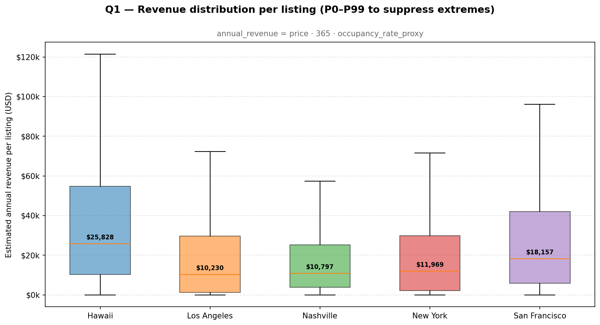

> **How to read.** Each box is the per-listing annual revenue proxy distribution for one city. The whisker on Hawaii is the longest because Hawaii contains the luxury-villa tail (price up to ~$85k/night). Median (the line inside the box) is what we anchor on, not the mean.

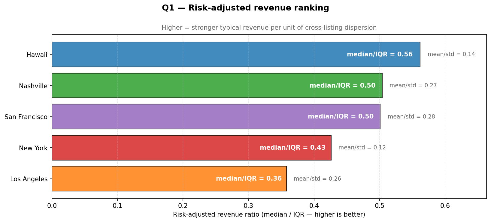

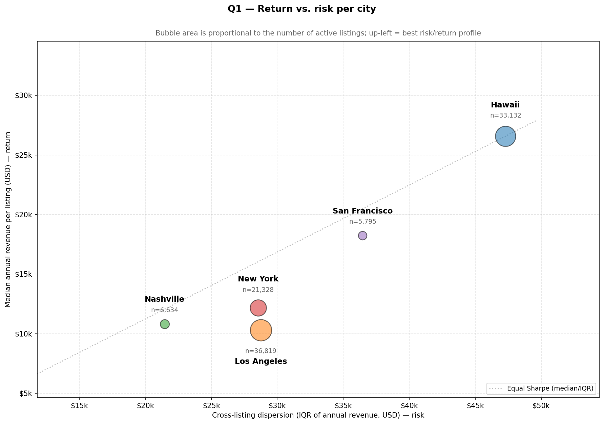

> **How to read.** X = IQR (cross-listing dispersion = "risk"). Y = median revenue per listing ("typical return"). Bubble size = number of listings in the city. **Top-left = high typical return, low dispersion**; that is the prime candidate. Hawaii dominates the Y axis but pays for it on X (highest IQR among the five). Nashville has the lowest IQR but also the second-lowest median.

| City          |   listings | median_price | median_occupancy | median_revenue | iqr_revenue | sharpe_mean_std | **sharpe_median_iqr** | sharpe_median_iqr_rank |
|:--------------|-----------:|:-------------|:-----------------|:---------------|:------------|----------------:|----------------------:|-----------------------:|
| Hawaii        |     33,132 | $233         | 31.0%            | **$26,582**    | $47,300     |           0.142 |             **0.562** |                  **1** |
| Nashville     |      6,634 | $158         | 16.0%            | $10,808        | $21,462     |           0.269 |                 0.504 |                      2 |
| San Francisco |      5,795 | $170         | 33.0%            | $18,256        | $36,466     |           0.276 |                 0.501 |                      3 |
| New York      |     21,328 | $154         | 24.0%            | $12,167        | $28,551     |           0.117 |                 0.426 |                      4 |
| Los Angeles   |     36,819 | $155         | 25.0%            | $10,300        | $28,752     |           0.264 |                 0.358 |                      5 |

Reading:

- **Hawaii is the cleanest pick on risk-adjusted revenue (median / IQR = 0.562, rank #1).** Median revenue per listing is **2.2×** the second-best median ($26,582 vs Nashville $10,808 / NYC $12,167) and the IQR penalty is not large enough to overturn the ranking.
- **Nashville is #2 on risk-adjusted revenue but on a much smaller revenue base.** It wins on dispersion (smallest IQR = $21,462) but ranks last on typical occupancy (16% median). Useful as a stable secondary market, not as primary destination for $500K.
- **Los Angeles ranks last on median/IQR (0.358).** LA has the largest *count* of listings (36,819) but the worst combination of low typical revenue ($10,300) and high IQR.

### 4.2 Q2 — Price · Occupancy · Revenue

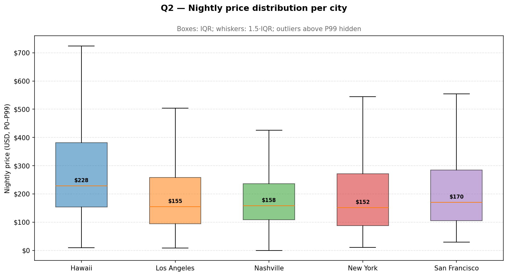

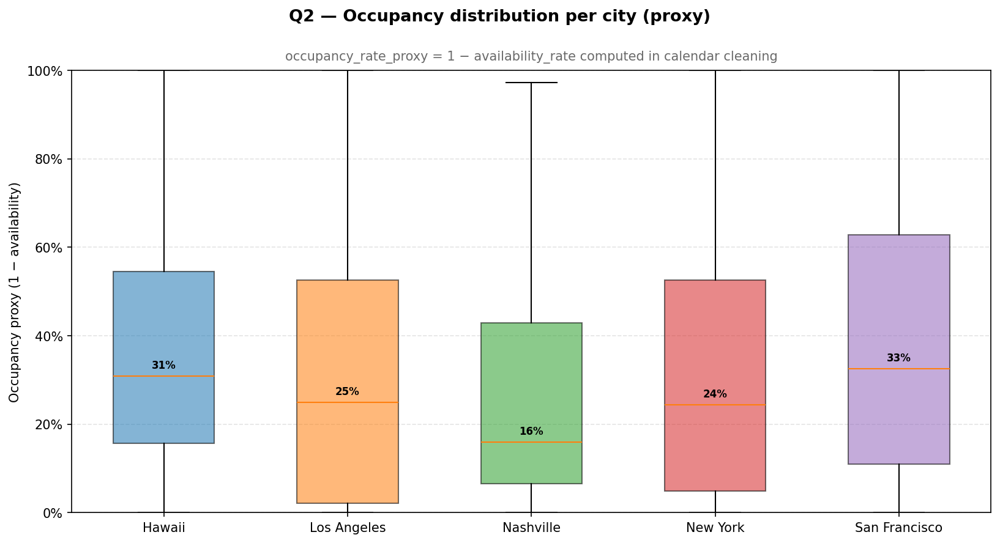

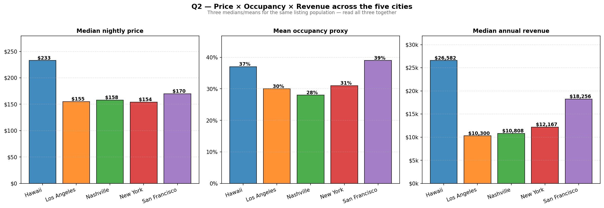

> **How to read.** Three side-by-side panels: median nightly price, mean occupancy, mean annual revenue. Each city has the same colour across panels so a city's "shape" across the three is easy to read.

| City          | listings | median_price | p25_price | p75_price | mean_occupancy | median_occupancy | mean_revenue | median_revenue |
|:--------------|---------:|:-------------|:----------|:----------|:---------------|:-----------------|:-------------|:---------------|
| Hawaii        |   33,132 | **$233**     | $155      | $400      | 37.0%          | 31.0%            | $185,990     | **$26,582**    |
| San Francisco |    5,795 | $170         | $105      | $285      | **39.0%**      | **33.0%**        | $41,007      | $18,256        |
| New York      |   21,328 | $154         | $89       | $279      | 31.0%          | 24.0%            | $62,300      | $12,167        |
| Nashville     |    6,634 | $158         | $109      | $236      | 28.0%          | 16.0%            | $21,022      | $10,808        |
| Los Angeles   |   36,819 | $155         | $95       | $260      | 30.0%          | 25.0%            | $30,749      | $10,300        |

Reading:

- **Most expensive (median nightly): Hawaii — $233.** All other cities cluster between $154 and $170, so Hawaii is a clear outlier in pricing power.
- **Highest typical occupancy: San Francisco (median 33%).** SF has the **smallest active supply** (5,795 listings) and the **highest demand utilisation**, which is why it ranks #1 on `mean_occupancy_rank` despite middling prices.
- **New York's mean revenue ($62,300) ≫ median revenue ($12,167).** This 5× ratio reveals a heavily right-skewed market: a handful of expensive listings dominate the mean. The median (the typical guest-paying listing) is only #3.

### 4.3 Q3 — Market saturation

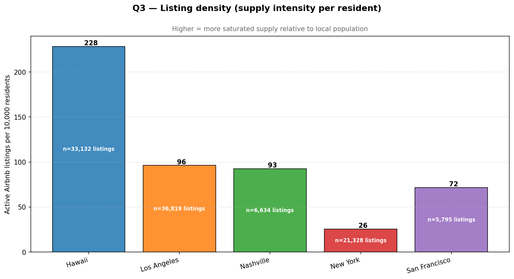

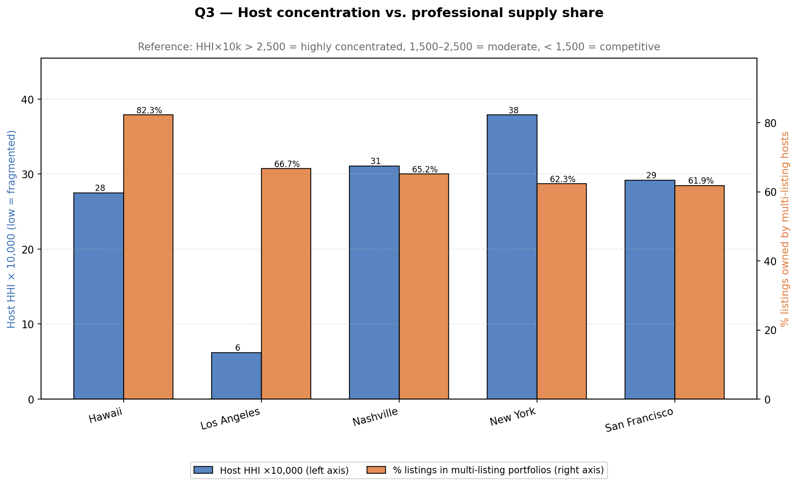

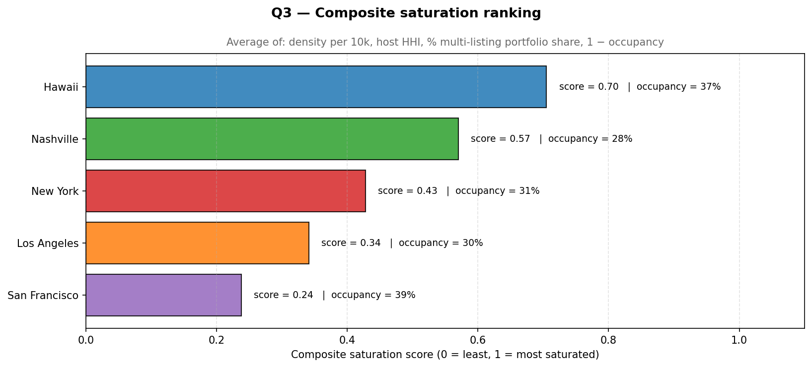

> **How to read.** Composite `saturation_score ∈ [0, 1]` aggregates four normalised facets — density, host HHI, multi-listing share and (1 − occupancy). Bars are sorted descending; higher = more saturated = harder for a new entrant to win.

| City          | listings | unique_hosts | population_2024 | listings_per_10k | mean_occupancy | host_hhi_x10k | top10_host_share | multi_listing_host_pct | share_listings_in_multi_host_portfolios | **saturation_score** | rank |
|:--------------|---------:|-------------:|----------------:|-----------------:|:---------------|--------------:|:-----------------|:-----------------------|:----------------------------------------|---------------------:|-----:|
| Hawaii        |   33,132 |        8,735 |       1,450,589 |       **228.40** | 37.0%          |            28 | 11.9%            | 32.9%                  | **82.3%**                                |            **0.705** |    1 |
| Nashville     |    6,634 |        3,009 |         715,884 |            92.67 | 27.9%          |            31 | 13.3%            | 23.3%                  | 65.2%                                    |                0.570 |    2 |
| New York      |   21,328 |       10,418 |       8,335,897 |            25.59 | 31.2%          |            38 | 13.9%            | 22.9%                  | 62.3%                                    |                0.428 |    3 |
| Los Angeles   |   36,819 |       17,165 |       3,820,914 |            96.36 | 30.3%          |             6 | 4.9%             | 28.6%                  | 66.7%                                    |                0.341 |    4 |
| San Francisco |    5,795 |        2,959 |         808,988 |            71.63 | **38.6%**      |            29 | 12.1%            | 25.3%                  | 61.9%                                    |            **0.238** |    5 |

Reading:

- **Hawaii is by far the most saturated market.** It is **2.4× denser** than any other city in our sample (228 listings/10k vs LA's 96 and NYC's 26) and **82% of its listings sit inside multi-listing host portfolios** — i.e. the supply is professionalised. A new $500K entrant in Hawaii will be competing against operators, not amateurs.
- **San Francisco has the most room for a new entrant** (saturation = 0.238). SF combines the **highest occupancy** in the sample (38.6% mean) with the smallest active supply (5,795 listings) — demand is healthy, supply is thin.
- **Los Angeles is structurally fragmented (host HHI = 6).** LA has 17,165 unique hosts — the lowest concentration in the sample. Saturation is 0.341 (rank #4) but on competition rather than density grounds: lots of small operators rather than a few large ones.
- **NYC reads "saturated by regulation, not by supply."** Density is the lowest of the sample (25.6 listings/10k) because Local Law 18 caps supply, not because demand is missing. The active-supply occupancy (31%) is moderate; the calendar-wide audit reports much higher figures for NYC because many listings sit blocked (see methodological note below).

### 4.4 Q4 — Seasonality

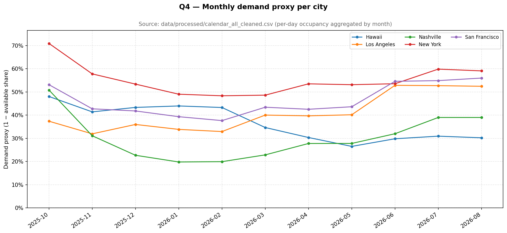

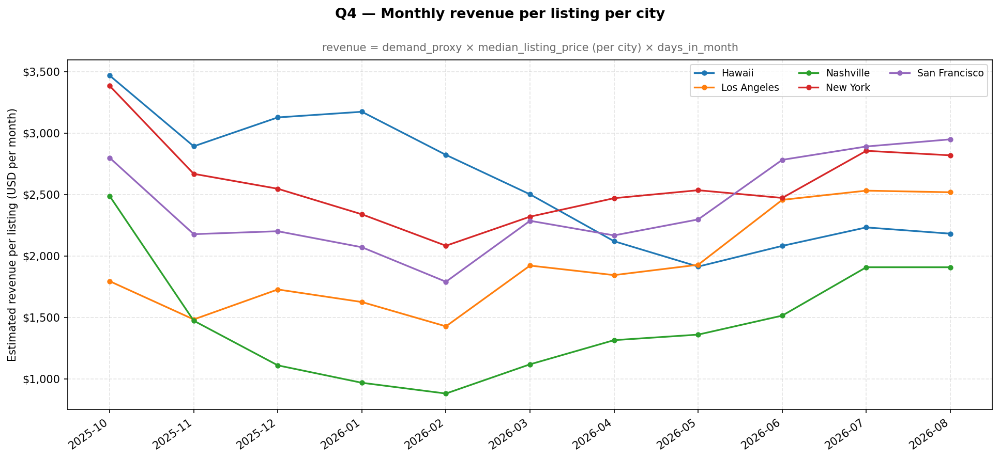

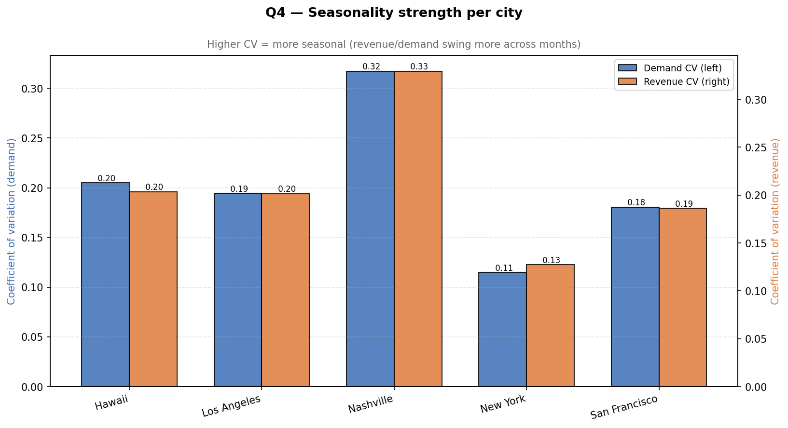

> **How to read.** Top: monthly `demand_proxy` per city (1 − mean(available)). Middle: monthly `revenue_per_listing = demand × median_price × days_in_month`. Bottom: coefficient of variation across complete months — higher = more seasonal. Partial first/last months were filtered out (the snapshot caps the calendar at ~12 months from the scrape date, so the trailing month is always partial).

| City          | n_months | demand_mean | demand_cv | demand_peak_month | demand_peak | demand_low_month | demand_low | revenue_mean | revenue_cv | revenue_peak_month | revenue_peak | revenue_low_month | revenue_low | revenue_peak_to_low |
|:--------------|---------:|:------------|----------:|:------------------|:------------|:-----------------|:-----------|:-------------|-----------:|:-------------------|:-------------|:------------------|:------------|--------------------:|
| Hawaii        |       11 | 36.6%       |    0.2049 | 2025-10           | 48.0%       | 2026-05          | 26.5%      | $2,592       |     0.2036 | 2025-10            | $3,468       | 2026-05           | $1,914      |                1.81 |
| Los Angeles   |       12 | 41.6%       |    0.1942 | 2026-06           | 52.8%       | 2025-11          | 31.9%      | $1,964       |     0.2016 | 2026-07            | $2,532       | 2026-02           | $1,428      |                1.77 |
| Nashville     |       11 | 30.2%       | **0.3172**| 2025-10           | 50.8%       | 2026-01          | 19.8%      | $1,459       | **0.3294** | 2025-10            | $2,488       | 2026-02           | $881        |            **2.82** |
| New York      |       12 | 55.5%       |    0.1149 | 2025-10           | 70.9%       | 2026-02          | 48.3%      | $2,603       | **0.1272** | 2025-10            | $3,384       | 2026-02           | $2,083      |            **1.62** |
| San Francisco |       12 | 47.9%       |    0.1805 | 2025-09           | 66.0%       | 2026-02          | 37.6%      | $2,481       |     0.1861 | 2025-09            | $3,365       | 2026-02           | $1,790      |                1.88 |

Reading:

- **Most stable revenue: New York (CV = 0.13, peak-to-low = 1.62).** Demand never falls below 48% even in February. NYC is structurally a "year-round business-and-tourism" market — the seasonality risk is small.
- **Most seasonal revenue: Nashville (CV = 0.33, peak-to-low = 2.82).** A listing that earns ~$2,500 in October will earn ~$880 in February. This is a real cash-flow-management problem for a single-asset investor (3× swing).
- **Hawaii is moderately seasonal (revenue CV = 0.20).** Peak month is October ($3,468) and trough is May ($1,914) — not catastrophic, but a single-asset Hawaii investor still sees a ~$1,500/month swing.
- **All five cities peak in autumn (Sep–Oct).** This is partly a real demand pattern (Sept = end of summer travel + business return) and partly a snapshot artefact (October sits earliest in the forward-looking calendar window, which Inside Airbnb populates more densely than the far horizon).

---

## 5. Hand-off to Block 2 (Segmentation) and Block 5 (Investment Decision)

Use this memo together with `results/01_market_analysis/*/per_city_*.csv` to set the **city-level prior**:

- **Top city for the $500K thesis: Hawaii.** Best risk-adjusted revenue (Q1 #1), highest median revenue per listing (Q2 #1), moderate seasonality (Q4 mid). The trade-off the rest of the project has to manage is **saturation** — Hawaii is the most saturated market (Q3 #1), so the entry strategy has to be **product-led** (specific neighborhood + segment), not "buy any listing."
- **Secondary candidate: San Francisco.** Lowest saturation (Q3 #5 = 0.238), highest occupancy (Q2 #1), reasonable risk-adjusted revenue (Q1 #3). The downside is small supply / small unique-host base — fewer comparables for Block 3's pricing model.
- **Reject as primary: Los Angeles** (Q1 #5 — worst risk-adjusted revenue) **and Nashville** (Q4 worst-case seasonality, peak-to-low 2.82×). Both can re-enter the conversation as **diversifiers** in Block 5's portfolio view if the goal is to reduce single-asset volatility.

Concrete asks for downstream blocks:

| Block | What this memo hands off |
| --- | --- |
| **Block 2 — Segmentation** | "Pick segments and neighborhoods *inside Hawaii*." Will's segmentation memo confirms that segments 0 / 3 (Premium mid-size active, Luxury large home) and neighborhoods Ewa / Koloa-Poipu / Lihue are the cleanest picks. |
| **Block 3 — Pricing model** | The Q4 demand seasonality table is the **calendar feature** the pricing model can use to predict *month-of-year* effects. The Q2 distributions (price quartiles per city) define the realistic search space. |
| **Block 4 — Guest experience** | Q1 names the cities where revenue dispersion is high; Block 4 explains *why* (review-driven sub-scores, complaint cues). |
| **Block 5 — Investment decision** | The portfolio view in Block 5 should respect Q4's CV ranking when it builds risk-weighted scenarios: NYC (CV 0.13) and SF (CV 0.19) are the natural diversifiers against a Hawaii-heavy core. |

---

## 6. Files

### Data outputs (`results/01_market_analysis/`)

| Folder | Files |
| --- | --- |
| `q1_risk_adjusted_revenue/` | `per_city_metrics.csv`, `q1_summary.md` |
| `q2_price_occupancy_revenue/` | `per_city_summary.csv`, `q2_summary.md` |
| `q3_market_saturation/` | `per_city_saturation.csv`, `q3_summary.md` |
| `q4_seasonality/` | `monthly_metrics.csv`, `per_city_seasonality.csv`, `q4_summary.md` |
| `calendars/` | `calendars_cleaning_audit.csv` (cleaning audit) |
| `listing/` | `listing_by_city_cleaning_summary.txt` (cleaning audit) |
| `reviews/` | `reviews_cleaning_audit.csv` (cleaning audit) |
| `market_analysis_memo.md` | This memo. |

### Figures (`reports/figures/01_market_analysis/`)

| Folder | Files |
| --- | --- |
| `q1_risk_adjusted_revenue/` | `01_q1_revenue_boxplot.png`, `02_q1_sharpe_ranking.png`, `03_q1_return_vs_risk.png` |
| `q2_price_occupancy_revenue/` | `01_q2_price_distribution.png`, `02_q2_occupancy_distribution.png`, `03_q2_three_metric_comparison.png` |
| `q3_market_saturation/` | `01_q3_density.png`, `02_q3_host_concentration.png`, `03_q3_saturation_score.png` |
| `q4_seasonality/` | `01_q4_monthly_demand.png`, `02_q4_monthly_revenue.png`, `03_q4_seasonality_strength.png` |
| `calendar/` | EDA figures used as supporting evidence (distribution / business-lens plots from `scripts/eda/inventory_processed_calendar.py`) |

### Scripts

| File | Purpose |
| --- | --- |
| `scripts/market_analysis/q1_risk_adjusted_revenue.py` | Q1 — per-city Sharpe-style metrics, return-vs-risk plot. |
| `scripts/market_analysis/q2_price_occupancy_revenue.py` | Q2 — price/occupancy/revenue distributions and ranks. |
| `scripts/market_analysis/q3_market_saturation.py` | Q3 — density, host HHI, multi-listing share, composite saturation score. |
| `scripts/market_analysis/q4_seasonality.py` | Q4 — chunked aggregation of `calendar_all_cleaned.csv`, monthly demand/revenue, CV-based seasonality strength. |

All four scripts use `mba706_toolkit` for `load_data` / `get_summary_statistics` / `create_visualization` where applicable; bespoke metrics (Sharpe-style, HHI, CV) are implemented in pandas + numpy directly because the toolkit does not cover them. `RANDOM_STATE = 42` is set even though Q1–Q4 do not include any stochastic step (kept for reproducibility convention).

---

## 7. Reproduction

1. Regenerate the cleaned dataset (the orchestrator must be run with the row-level calendar flag because Q4 needs day-level data):

   ```bash
   python scripts/cleaning/run_cleaning_pipeline.py --calendar-write-row-files
   ```

2. Run the four market-analysis scripts (they are independent and can be run in any order):

   ```bash
   python scripts/market_analysis/q1_risk_adjusted_revenue.py
   python scripts/market_analysis/q2_price_occupancy_revenue.py
   python scripts/market_analysis/q3_market_saturation.py
   python scripts/market_analysis/q4_seasonality.py
   ```

3. Outputs appear under `results/01_market_analysis/q*/` and `reports/figures/01_market_analysis/q*/`. Each script also rewrites its own `q*_summary.md`.

Rough runtime: Q1–Q3 finish in well under a minute each on a MacBook (single load of `master_data.csv`, ~270 MB). Q4 streams the ~3 GB `calendar_all_cleaned.csv` and takes ~3–5 minutes depending on disk speed. All paths are `PROJECT_ROOT`-relative so the scripts also run on a clean clone.
