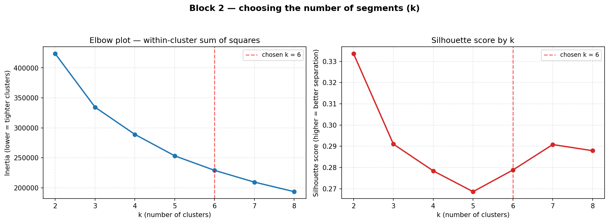
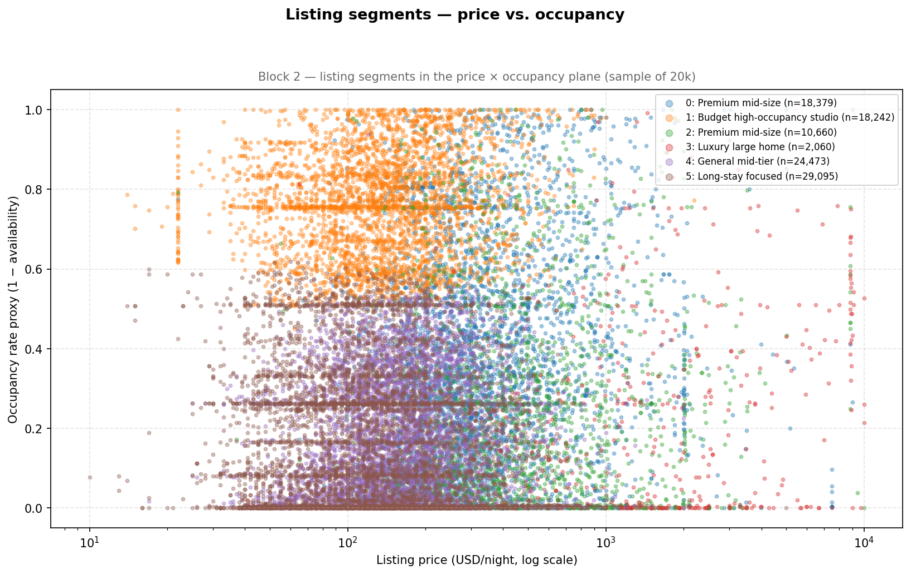
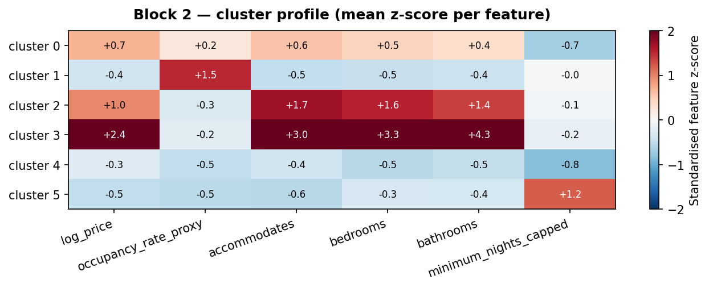
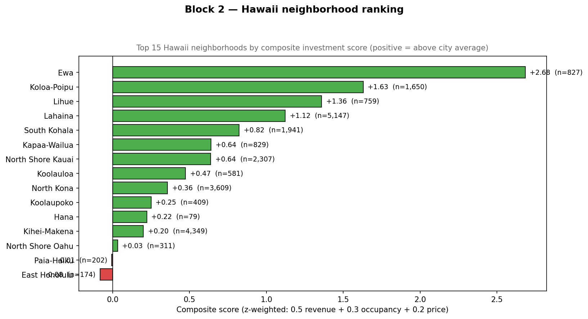
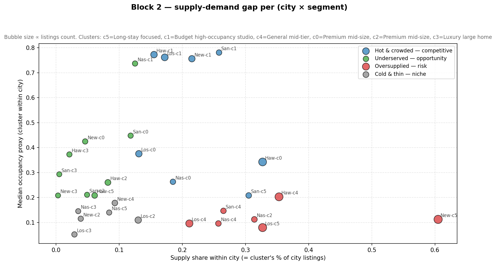

# Block 2 Memo — Neighborhoods & Segments (K-Means)

> Owner: Yu Wang  
> Last updated: 2026-04-30  
> Input: `data/master_data_calendar-write-row-files/master_data.csv` (102,909 listings, 5 cities)  
> Top city for ranking: **Hawaii** — chosen via Block 1 / Q1 (risk-adjusted revenue, median ÷ IQR rank #1).  
> A Chinese-language copy of this memo is kept at `segmentation_memo_CN.md`.

---

## TL;DR

We segmented **102,909 cleaned listings** across the five cities into **6 clusters** using K-Means on six listing-level features. Inside Hawaii — the city ranked #1 by Block 1 — three neighborhoods stand out (**Ewa, Koloa-Poipu, Lihue**) and two segments look like real opportunities (**Luxury large home, c3** and **Premium mid-size, c0**). One segment in Hawaii is clearly oversupplied (**General mid-tier, c4**, 35% of supply but only 20% occupancy) and should be avoided.

---

## 1. The question we are answering

The Block 2 brief asks four questions:

1. Which neighborhoods within the top city offer the best revenue potential?
2. Are there distinct listing segments (budget studio, luxury beachfront, family suburban …) with different revenue profiles?
3. Which segments are oversaturated and which are underserved?
4. Do certain neighborhoods command a price premium that is **not** justified by occupancy?

Block 1 already picked Hawaii as the best risk-adjusted market. Block 2's job is to drill down to **neighborhood + segment level** inside Hawaii, while still producing the cross-city segment view that Blocks 3 / 4 / 5 will consume.

---

## 2. Inputs

One file is used: `data/master_data_calendar-write-row-files/master_data.csv`. This is the canonical, listing-level cleaned table produced by the team's joint pipeline:

- `listings.csv` cleaning — Belu
- `reviews.csv` cleaning — Agostino
- `calendar.csv` cleaning + occupancy/revenue derivation — Yu Wang (the calendar pipeline written for Block 0)

After bounds filtering and per-city median imputation for `bedrooms` / `bathrooms`, **102,909 listings (~99%)** are retained.

---

## 3. Method

### 3.1 Feature engineering

We cluster on six numeric features per listing:

| Feature | Why it matters |
| --- | --- |
| `log_price` | Price is heavily right-skewed (Hawaii has $85k luxury villas). Logging it tames the tail before standardisation. |
| `occupancy_rate_proxy` | The team-wide occupancy proxy (1 − availability). Core dimension of every revenue calculation. |
| `accommodates` | Capacity — separates studios from family homes. |
| `bedrooms` | Independent of accommodates: a 1-bed sleeping 4 is very different from a 4-bed sleeping 4. |
| `bathrooms` | Splits "small unit" from "full house" cleanly. |
| `minimum_nights_capped` | Clipped to [1, 30] so long-stay listings (some have `min_nights = 1125`) don't dominate distances. |

Pre-clustering hygiene:

- `price ∈ [10, 10 000]`, `occupancy ∈ [0, 1]`, `accommodates ∈ [1, 16]` (drop rows outside)
- `bedrooms` / `bathrooms` missing → fill with **city-level median** (so Hawaii NaNs aren't filled with NYC values)
- All features standardised (z-score) before fitting

### 3.2 Choosing k

`mba706_toolkit.perform_elbow_analysis` was run for `k = 2..8`:



| k | inertia | silhouette |
| ---: | ---: | ---: |
| 2 | 423,662 | **0.334** |
| 3 | 334,490 | 0.291 |
| 4 | 289,076 | 0.278 |
| 5 | 253,378 | 0.269 |
| 6 | 229,136 | **0.279** |
| 7 | 209,532 | 0.291 |
| 8 | 193,621 | 0.288 |

Unconstrained, the toolkit recommends `k=2`. **We rejected `k=2`** because it would only split listings into "expensive" vs "everything else" — useless for the brief, which explicitly asks for distinct segments. We constrained `k ∈ [4, 6]` for business explainability and picked the silhouette maximum within that band → **`k = 6`**, silhouette = 0.279 ("moderate separation"). The differences across the 4–6 band are < 0.02, so the statistical cost is small and the business value is large.

### 3.3 Cluster naming

After fitting, every cluster is auto-named from its centroid using simple business rules (e.g. `min_nights ≥ 25` → "Long-stay focused"; `price ≥ $400` and `bedrooms ≥ 3` → "Luxury large home"). Final labels:

| cluster | name | n_listings | share | median price | median occupancy | annual rev. proxy | top room type | top city |
| ---: | --- | ---: | ---: | ---: | ---: | ---: | --- | --- |
| 5 | Long-stay focused | 29,095 | 28.3% | $125 | 10.7% | $4,882 | Entire home/apt | New York |
| 1 | Budget high-occupancy studio | 18,242 | 17.7% | $136 | 76.2% | $37,826 | Entire home/apt | Los Angeles |
| 4 | General mid-tier | 24,473 | 23.8% | $153 | 16.4% | $9,159 | Entire home/apt | Hawaii |
| 0 | Premium mid-size *(active)* | 18,379 | 17.9% | $312 | 34.8% | $39,630 | Entire home/apt | Hawaii |
| 2 | Premium mid-size *(slow-turn)* | 10,660 | 10.4% | $395 | 16.4% | $23,645 | Entire home/apt | Los Angeles |
| 3 | Luxury large home | 2,060 | 2.0% | $1,424 | 19.7% | **$102,393** | Entire home/apt | Los Angeles |

Note: clusters 0 and 2 share the auto-name "Premium mid-size" but split on **occupancy** — c0 turns over twice as fast (35%) as c2 (16%). I treat them as two distinct economic profiles.

### 3.4 Hawaii neighborhood ranking

Within Hawaii (neighborhoods with ≥ 30 listings only) we compute z-scores of three medians (revenue, occupancy, price) and combine them:

`composite_score = 0.5 · z(revenue) + 0.3 · z(occupancy) + 0.2 · z(price)`

We also compute `premium_gap = z(price) − z(occupancy)`:

- Positive → priced above what occupancy supports (overpriced)
- Negative → priced below what occupancy supports (room to raise prices)

### 3.5 Supply-demand gap

Per `(city, cluster)` we measure supply share (cluster's % of city listings) vs demand (median occupancy in that pair). Each pair is classified against the cross-city medians into four buckets:

- **Hot & crowded** — high occ + high supply (competitive)
- **Underserved** — high occ + low supply (opportunity)
- **Oversupplied** — low occ + high supply (risk)
- **Cold & thin** — low occ + low supply (niche)

---

## 4. Results

### 4.1 The six segments



> **How to read.** Each dot is one listing (sample of 20k for legibility). The high-occupancy budget cluster (`c1`, orange) is the dense band along the top of the chart. The luxury cluster (`c3`, red) sits to the far right at $1k+/night. The two "Premium mid-size" clusters (`c0`, `c2`) overlap horizontally but separate vertically by occupancy.



> **How to read.** Red = above average for that feature, blue = below. Cluster 3 (luxury) is solid red on price/accommodates/bedrooms/bathrooms; cluster 5 (long-stay) is the only one solid red on `minimum_nights_capped`; cluster 1 (budget high-occupancy) is the only one solid red on `occupancy_rate_proxy`. The story each cluster tells is visible at a glance.

### 4.2 Hawaii neighborhood ranking



Top 10 (full table in `neighborhood_rankings.csv`):

| rank | neighborhood | n_listings | median price | median occupancy | median revenue | premium_gap | composite_score |
| ---: | --- | ---: | ---: | ---: | ---: | ---: | ---: |
| 1 | **Ewa** | 827 | $461 | 47.7% | $62,092 | +0.04 | **+2.68** |
| 2 | Koloa-Poipu | 1,650 | $383 | 35.2% | $50,601 | +0.71 | +1.63 |
| 3 | Lihue | 759 | $286 | 37.3% | $47,128 | −0.68 | +1.36 |
| 4 | Lahaina | 5,147 | $367 | 31.8% | $40,866 | +0.95 | +1.12 |
| 5 | South Kohala | 1,941 | $318 | 29.3% | $38,225 | +0.69 | +0.82 |
| 6 | Kapaa-Wailua | 829 | $249 | 32.6% | $34,060 | −0.53 | +0.64 |
| 7 | North Shore Kauai | 2,307 | $278 | 30.7% | $34,113 | +0.05 | +0.64 |
| 8 | Koolauloa | 581 | $300 | 28.5% | $30,318 | +0.59 | +0.47 |
| 9 | North Kona | 3,609 | $200 | 34.2% | $27,384 | **−1.30** | +0.36 |
| 10 | Koolaupoko | 409 | $262 | 29.9% | $24,975 | −0.03 | +0.25 |

Reading:

- **Ewa** is the cleanest pick — top-of-the-board on every metric and the price/occupancy gap is balanced (`premium_gap ≈ 0`).
- **Lihue** has the largest negative `premium_gap` in the top-3 (−0.68): occupancy is high (37%) relative to its price ($286). That suggests **headroom to push prices** without losing demand.
- **North Kona** (#9) is even more striking — `premium_gap = −1.30`. Demand is well above what its prices imply.
- **Lahaina** and **Koolauloa** show the opposite: positive `premium_gap` (+0.95, +0.59) — they are priced above what their occupancy supports today.

### 4.3 Supply-demand gap (city × segment)



Hawaii zoom-in (full table in `segment_supply_demand_gap.csv`):

| cluster | name | listings | supply share | median occ | status |
| ---: | --- | ---: | ---: | ---: | --- |
| 1 | Budget high-occupancy studio | 5,067 | 15.5% | 77.3% | Hot & crowded |
| 3 | Luxury large home | 684 | 2.1% | 37.3% | **Underserved — opportunity** |
| 0 | Premium mid-size (active) | 10,699 | 32.7% | 34.2% | Hot & crowded |
| 2 | Premium mid-size (slow-turn) | 2,685 | 8.2% | 26.0% | **Underserved — opportunity** |
| 5 | Long-stay focused | 2,001 | 6.1% | 20.8% | **Underserved — opportunity** |
| 4 | General mid-tier | 11,533 | 35.3% | 20.3% | **Oversupplied — risk** |

Reading:

- **Underserved**: clusters 3 (luxury), 2 (premium slow-turn), 5 (long-stay) — all run higher occupancy than their slim supply-share would predict.
- **Hot & crowded**: clusters 1 and 0 — strong demand, but a third of Hawaii's supply is already there. Entering these requires a clear product edge.
- **Oversupplied**: cluster 4 — over a third of Hawaii's listings, but only 20% occupancy. New entrants here would compete on a flat line and most would lose.

---

## 5. Hand-off to Block 5 (Investment Decision)

Use `cluster_assignments.csv` (one row per listing: `listing_id, City, neighbourhood_cleansed, room_type, cluster, cluster_name`) as the canonical join key.

Recommended short-list for Hawaii investment:

- **Segments**: Luxury large home (cluster 3) and Premium mid-size active (cluster 0).
- **Neighborhoods**: Ewa, Koloa-Poipu, Lihue.
- **Pricing tip from `premium_gap`**: Lihue and North Kona look under-priced for their demand — Block 3's pricing model should test whether they can sustain a price increase.

Watch list:

- Avoid cluster 4 in Hawaii (oversupplied).
- Avoid neighborhoods with positive `premium_gap` until Block 4 (guest experience) confirms why guests are still paying — without that confirmation those listings are at risk of price compression.

---

## 6. Files

### Data outputs (`results/02_segmentation/`)

| File | Purpose |
| --- | --- |
| `cluster_silhouette.csv` | k=2..8 inertia + silhouette — evidence for the k=6 choice |
| `cluster_profiles.csv` | Per-cluster medians, sizes, auto-names |
| `cluster_assignments.csv` | Listing → cluster mapping (Block 5 join key) |
| `neighborhood_rankings.csv` | Hawaii neighborhoods, full ranking with z-scores and `premium_gap` |
| `segment_supply_demand_gap.csv` | Per (city, cluster) supply share, occupancy, classification |
| `segmentation_summary.md` | Auto-generated table dump (regenerated on every run) |
| `segmentation_memo.md` | This memo (English) |
| `segmentation_memo_CN.md` | Chinese mirror of this memo |

### Figures (`reports/figures/02_segmentation/`)

| File | Purpose |
| --- | --- |
| `01_elbow_silhouette.png` | k selection chart |
| `02_cluster_scatter_price_occupancy.png` | Scatter of price × occupancy, coloured by cluster |
| `03_cluster_profile_heatmap.png` | z-score heatmap of cluster centroids |
| `04_neighborhood_ranking_hawaii.png` | Top-15 Hawaii neighborhoods bar chart |
| `05_supply_demand_gap.png` | City × cluster supply-demand bubble chart |

### Script

`scripts/models/segmentation_kmeans.py` — single, idempotent, end-to-end. Uses `mba706_toolkit.load_data`, `perform_elbow_analysis`, `perform_kmeans_clustering` and `RANDOM_STATE = 42`.

---

## 7. Reproduction

```bash
python3 scripts/models/segmentation_kmeans.py
```

Runtime ≈ 8 minutes on a MacBook (one CSV load of 270 MB, elbow scan over k=2..8, final k=6 fit, 5 figures, 1 memo). All paths are `PROJECT_ROOT`-relative so the script also runs on a clean clone.
