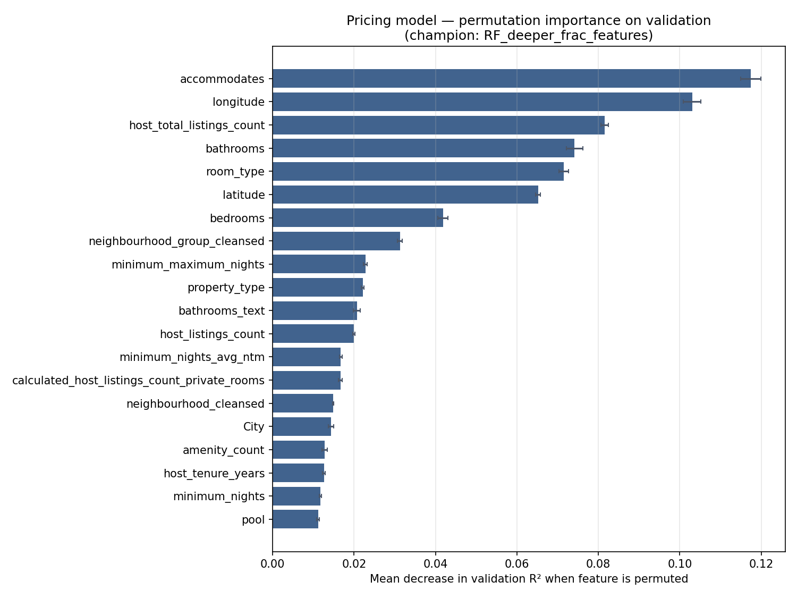
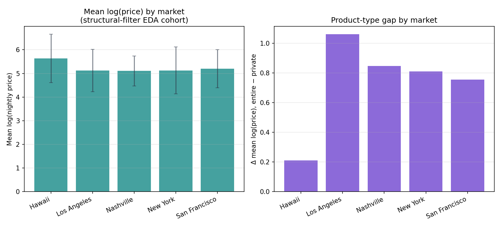
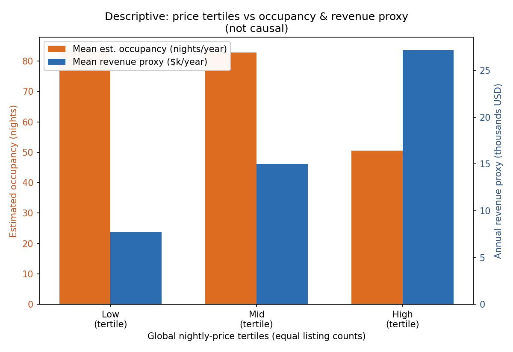

# Airbnb Investment Project — Pricing Block: Integrated Memo

**Audience:** Strategy and investment colleagues reviewing the Pricing workstream  
**Prepared as:** Standalone consolidated narrative (not the final multi-workstream group memo)  
**Status:** All metrics, splits, tables, and figure values below are sourced from **existing project outputs only** (`property_pricing_*`, `modeling/training_outputs_property_pricing/`, `pricing_optimization_*`, `pricing_optimization_descriptive/outputs/`, and selected `eda/` summaries). No models were retrained and no figures use invented data.

---

## Executive orientation

Airbnb underwriting ultimately rests on whether **pricing power** and **commercial intensity** (booked or estimated nights at those prices) can support the required risk-adjusted returns. **This Pricing block tackles two complementary questions:**

1. **What observable listing traits best predict nightly advertised price?** — a supervised **prediction** lens on **`log(price)`**, with explicit model comparison between Random Forest and gradient-boosted tree specifications.
2. **How—descriptively—do nightly price, estimated annual occupancy (proxy), and annual revenue proxy line up across listings and bands?** — a **cross-sectional** framing that links to **conceptual revenue = price × nights** ahead of formal elasticity work.

Together, block (1) supports **comps intelligence and benchmarking** after capacity, geography, product type, and policy controls. Block (2) underscores **heterogeneity**, **potential price–occupancy tension**, and the **limitations of treating correlations as causal levers.**

---

## 1. Why pricing matters for the investment decision

- **Listed nightly price (“ADR positioning”) is the direct translation of positioning into dollars per night.** Even when transactions differ from ask, modeled price drivers tell us **which portfolios co-locate at premium vs commodity ADR** conditional on observable structure — essential for underwriting relative to comps.
- **Revenue aggregates depend on intensity as well as price.** The descriptive leg of this block uses **`estimated_occupancy_l365d`** with **`annual_revenue_proxy = price × estimated_occupancy_l365d`** to show how cross-sectional **price** and **intensity** can offset or reinforce—not to replace audited cash flows.
- **Markets diverge materially.** Pricing levels and entire-home versus private-room premia vary by metro; extrapolating **one nation-wide rule-of-thumb misallocates** diligence effort.
- **Clarity today reduces costly mistakes tomorrow.** Explicit separation of **predictive pricing** versus **descriptive revenue composition** aligns the technical work with investor questions (“what rents,” “who books,” **but not yet** “what happens if we reprice causally”) before the **final consolidated investment memo.**

---

## 2. Analytical approach (concise)

| Leg | Goal | Technique | Key output artefact locations |
|-----|------|-----------|------------------------------|
| **Property / nightly pricing model** | Predict **`log(price)`** from sanctioned listing covariates; compare learners | Stratified **`City × room_type`** splits; pipelines with imputation + one-hot; **four** specs (two RF, two HistGradientBoosting); champion by **validation** performance | `model_comparison_table.csv`; `feature_importance_permutation_validation.csv` |
| **Pricing optimization preparation (descriptive)** | Describe joint behavior of price, **`estimated_occupancy_l365d`**, **`annual_revenue_proxy`** | Filters on valid positive price / occupancy range; correlations; means by **`City`** and **`room_type`**; equal-count **price tertiles** | `pricing_optimization_descriptive/outputs/tables/*` |

The two legs **do not reuse model scores as inputs** between them; interpretation stays modular.

---

## 3. Model comparison: Random Forest vs boosted trees

### 3.1 Selection rule

The training script crowned the champion specification by **maximizing validation R²**, with validation **RMSE** as tie-break—not test-set performance. Keeping test metrics **honest-but-auditory** lowers **silent overfitting** to incidental test noise when choosing among close candidates.

Split sizes (training pipeline): **62,100 train / 20,700 validation / 20,700 test** (**≈ 60 % / 20 % / 20 %**), consistent with **`data_split_sizes.csv`** cited in supporting documentation.

### 3.2 Results (all targets on `log(price)`)

| Model | Train R² | Val R² | Val RMSE | Test R² | Test RMSE | Test MAE |
|-------|----------|--------|----------|---------|-----------|---------|
| **RF_deeper_frac_features** (**champion**) | 0.9566 | **0.8461** | **0.3838** | **0.8386** | **0.3837** | **0.2531** |
| HistGBDT_deeper_faster_lr | 0.8761 | 0.8424 | 0.3884 | 0.8373 | 0.3852 | 0.2658 |
| HistGBDT_moderate_depth | 0.8283 | 0.8152 | 0.4207 | 0.8106 | 0.4156 | 0.2879 |
| RF_shallow_sqrt_features | 0.7505 | 0.7327 | 0.5058 | 0.7304 | 0.4958 | 0.3468 |

*(Source: `modeling/training_outputs_property_pricing/model_comparison_table.csv`; values rounded here for readability.)*

**Winner:** **`RF_deeper_frac_features`**. Validation **R² ≈ 0.846**, slightly above the tighter boosted specification; validation **RMSE** is also narrowly better. Held-out **test R² ≈ 0.839** confirms retained generalization—not used for selection. The materially shallow RF baseline underscores that **architecture and depth materially matter.**

### 3.3 Business read

Across this specification grid, Random Forest—with the deeper, **`max_features`**-rich configuration—is the **validated workhorse for explaining listed nightly pricing** alongside interpretable permutation rankings. Histogram gradient boosting stays **economically plausible** (**val R² ≈ 0.84–0.81**)—useful challenger context when discussing **alternative functional forms**, but **not** the leaderboard winner under the agreed rule.

---

## 4. Feature importance — central interpretive section

### 4.1 What permutation importance means (rigorous plain language)

Permutation importance **shuffles each column randomly on the validation set** while holding all other inputs fixed, **re-score** predictions, and record how much **`R²`** (here) declines **on average.** Larger drops mean **the model leaned on that variable** to reconstruct **`log(price)`** in-sample of that validation cohort after preprocessing.

Crucially: this is **about predictive contribution to listed price given the correlations in the scraped cross-section—not** causal “if you add X, ADR rises by Y.” Confounders (**location vs quality vs host strategy**) jointly drive both price and observables.

### 4.2 Top drivers (numerical excerpts from permutation table)

Highest mean validation impacts (among non-degenerate noise columns), from **`feature_importance_permutation_validation.csv`**:

| Rank | Feature | Mean permutation drop in val R² (approx.) |
|------|---------|------------------------------------------|
| 1 | accommodates | **0.117** |
| 2 | longitude | **0.103** |
| 3 | host_total_listings_count | **0.082** |
| 4 | bathrooms | **0.074** |
| 5 | room_type | **0.071** |
| 6 | latitude | **0.065** |
| 7 | bedrooms | **0.042** |
| … | neighbourhood_group_cleansed, policy min/max-night fields | **material but smaller** |

**Excluded from figure:** `amenities_parse_ok` shows **0** in the CSV’s permutation sweep (parse flag did not materially move **`R²`** on this permutation run); **`wifi`** shows **near-zero** importance (**≈ 3.5×10⁻⁵** mean)—consistent with ubiquitous amenity signalling little marginal price variation **after conditioning on other hedonic stacks.**

### 4.3 Business-readable driver buckets

**(A) Capacity & layout.** **`accommodates`**, **`bathrooms`**, **`bedrooms`**, **`beds`**, and **`bathrooms_text`** sit high — pricing lines up sharply with guest scale and sanitary/sleep inventory. **Investors underwriting “extra bedroom” uplift should treat comps within similar capacity strata.**

**(B) Location.** **`longitude`/`latitude`**, granular **`neighbourhood_*`** fields, **`City`** — micro-market and coarse metro effects matter; **pricing is geographically conditional.** No single latent “Airbnb Beta” summarizes all five cohorts.

**(C) Room & property taxonomy.** **`room_type`** / **`property_type`** carry strong permutation signal—pricing discipline must **segment comps by product.**

**(D) Operating & host-structure rules.** **`minimum_*`** / **`maximum_*`** nights, **`instant_bookable`**, host listing counts (**`calculated_*`**, **`host_listings_count`**), **`host_tenure_years`** contribute—reflecting scheduling constraints **and portfolio commercialization**, not causal policy experiments.

**(E) Amenities.** **`amenity_count`** plus **`pool`** register meaningfully versus many single binaries (`kitchen`, **`hot_tub`**, washers/dryers, etc. **smaller incremental role** versus capacity and geo).

**Takeaway:** The champion model’s story is coherent: **nightly price concentrates on scalable guest units, anchored geography and product taxonomy, embellished by institutional host signals and differentiated amenities — all associational.**

---

## 5. Market-level findings

**Mean log(price) cohort** (EDA structural-filter analytic sample summarized in **`eda/summary_logprice_by_city.csv`**):

| City | Approx. listings | Mean log(price) |
|------|------------------|----------------|
| Hawaii | 33,113 | **5.634** |
| Los Angeles | 36,750 | **5.118** |
| New York | 21,313 | **5.128** |
| Nashville | 6,623 | **5.107** |
| San Francisco | 5,793 | **5.202** |

**(Dispersion caveat:** Honolulu-weighted **`Hawaii`** cohort shows materially higher dispersion in exploratory summary stats—pricing diligence must tolerate **skew and luxury tails**.)

**Entire-home minus private-room mean-log-price gap (`eda/summary_city_entire_minus_private_gap.csv`):**

| City | Gap (log-units), entire − private |
|------|-------------------------------------|
| Los Angeles | **1.061** |
| Nashville | **0.848** |
| New York | **0.810** |
| San Francisco | **0.754** |
| Hawaii | **0.211** |

**Interpretation:** The **premium for entire homes relative to private rooms is not transferable** metro-to-metro—even **ordering** differs from naive coastal intuition. **`Hawaii`**’s comparatively **narrow** uplift signals **localized product interplay** versus Los Angeles. **Investment implications:** **comps sets, underwriting templates, amenity capex hypotheses, and min-stay hypotheses require market-specific overlays** — the model learns `City`-conditioned predictor sets, yet human judgment must still reconcile micro-market anecdotes.

For example **`03_summary_by_city.csv`** shows mean nightly price ~**946 USD** (**Hawaii**) vs ~**224 USD** (**Nashville**) and varying estimated-occupancy means — explicit cross-cutting dispersion worth stress-testing in underwriting stories, separate from **`log(price)` modelling.**

## 6. Amenity associations (not ROI guarantees)

Supporting QA from amenities parsing summarized in **`property_pricing_evidence_pack.md`**: strict JSON-array parse succeeded on **≈99.97%** of master rows (**34 failures**)—engineered amenity binaries are statistically usable.

**Highest-permutation-impact amenity-aligned signals:**

- **`pool`** permutation mean **≈ 0.011** — materially among binary flags.
- **`amenity_count`** **≈ 0.013** — breadth signal beyond individual bits.

**Moderate / thinner:** **`kitchen`**, **`hot_tub`**, **`pets_allowed`**, etc. contribute **fractionally** versus capacity and geo.

**Looks weaker-than-intuition:** ubiquitous **`wifi`** shows **minimal marginal predictive lift** conditional on stacked covariates — consistent with a commodity amenity.

**Repeated caution:** these describe **patterns among listings scraped at a point in time** — never automatic renovation ROI calculators without operational and demand controls.

---

## 7. Pricing optimization thread — descriptive price, occupancy proxy, revenue proxy

*Independent from the nightly-price predictor matrix X; same upstream integration.*

### 7.1 Definitions & sample hygiene

Working descriptive sample (**after invalid nightly price exclusions**): **103,707** listings with **`estimated_occupancy_l365d`** valid in-range. **`annual_revenue_proxy = price × estimated_occupancy_l365d`**, aligned with **`estimated_revenue_l365d`** mechanically on filtered rows.

Equal **listing-count nightly-price tertiles** — global cutpoints approximate **≈ $132 / $250** nightly (see **`05b`** and optimization evidence inputs). **High-band mean nightly price spikes** (**≈ $1,540** mean) precisely because tertiles are **quantity-based**, not dollar-width — all listings above roughly **~$250** remain in High.

*(Bar chart regenerated strictly from **`05_price_bands_tertiles_overall.csv`.**)* 

### 7.2 Correlations among price, occupancy, proxy revenue

Pearson matrix from **`pricing_optimization_descriptive/outputs/tables/02_correlation_pearson.csv`:**

|  | Price | Estimated occ. | Revenue proxy |
|--|-------|----------------|----------------|
| Price | 1.00 | **−0.086** | **0.188** |
| Estimated occ. | **−0.086** | 1.00 | **0.188** |

As summarized in **`pricing_optimization_block_memo.md`**, **`log(price)` versus estimated occupancy** is about **−0.16** descriptively—**softer cross-sectional “price ↔ fewer estimated nights”.**

### 7.3 Tertile averages (explicit table)

*(Source: **`05_price_bands_tertiles_overall.csv`**)**

| Band | Listings | Mean nightly USD | Mean est. occupancy (nights/yr) | Mean annual revenue proxy (USD) |
|------|-----------|------------------|---------------------------------|--------------------------------|
| Low | 34,650 | 86 | 84 | ~7,703 |
| Mid | 34,844 | 184 | 83 | ~15,011 |
| High | 34,213 | 1,540 | 51 | **~27,189** |

**Descriptive synthesis:** Mean **estimated occupancy falls** toward the pricey tertile, yet mean **annual revenue proxy still rises**, driven by extreme nightly rates in tail listings — **association across heterogeneous inventory, NOT proof that raising posted price mechanically raises audited revenue.**

**NOT ELASTICITY:** No instrumental strategy, causal panel identification, randomized repricing experiments, nor structural booking demand estimation appear in this memo — by design.

---

## 8. Investor implications

1. **Priced quality tends to articulate through guest scale, geography, taxonomy, constrained supply micro-markets — and secondarily differentiated amenities and host operating posture.** Underwriting should **anchor on capacity, geography, and room/product archetype parallels** rather than anecdotes alone.

2. **Local beats global.** Materially different **metro premia**, **whole-home uplift**, nightly price levels, and occupancy proxies imply **scenario analysis and optimization must localize**.

3. **Revenue underwriting must respect both ADR proxies and occupancy proxies.** **`annual_revenue_proxy`** remains **constructed from estimated — not audited — stay counts**; causal statements wait on future elasticity tooling.

Conceptual linkage to portfolio logic: **`revenue intuition ≈ price × nights × horizon-awareness`** — aligns with **`annual_revenue_proxy = price × estimated_occupancy_l365d`** for communication, **never** substitutes for audited P&L.

---

## 9. Limitations — explicit ledger

| Domain | Caveat |
|--------|--------|
| **Prediction vs causal** | Model fit & permutation quantify **association / prediction**, **not uplift from interventions.** |
| **Listed vs realized outcomes** | Nightly **`price`** is scraped ask; **`estimated_*`** occupancy and revenue proxies are estimator outputs—transactions may differ materially. |
| **Proxy occupancy ≠ operations truth** | `estimated_occupancy_l365d` is **estimated annual nights**, not audited guest ledgers; calendar occupancy proxies excluded from nightly-price predictors by design. |
| **Market heterogeneity** | City and product strata **vary non-uniformly**; guardrails are thin for rare asset types (e.g. **hotel-room** outliers in **`04_summary_by_room_type.csv`** with tiny **n≈690** and extreme dispersion). |
| **Selection & quality bias** | Listings form a scrape cross-section — not representative of all dwellings in an MSA. |
| **Elasticity unfinished** | No causal pricing optimization coefficients — this memo documents **descriptive foundations only** for the second thread. |
| **Scope boundary** | This document does not consolidate non-pricing streams (regulation, comps supply, capex IRR, etc.); the **final investment memo merges those later**. |

---

## Source artefact crosswalk (audit)

| Content | Primary files |
|---------|----------------|
| Detailed nightly-price narrative | `property_pricing_block_memo_detailed.md`, `property_pricing_team_update.md` |
| Evidence digest & QA hooks | `property_pricing_evidence_pack.md`, `eda/amenities_parse_summary_metrics.csv` |
| Model leaderboard | `modeling/training_outputs_property_pricing/model_comparison_table.csv` |
| Interpretation backbone | `modeling/training_outputs_property_pricing/feature_importance_permutation_validation.csv` |
| Descriptive economics story | `pricing_optimization_block_memo.md`, `pricing_optimization_team_update.md`, `pricing_optimization_evidence_notes.md` |
| Supporting tables | `pricing_optimization_descriptive/outputs/tables/*.csv`; `eda/summary_logprice_by_city.csv`; `eda/summary_city_entire_minus_private_gap.csv` |
| New figures (**this memo only**) | `./pricing_final_feature_importance_figure.png`, `./pricing_final_city_comparison_figure.png`, `./pricing_final_price_band_figure.png` |

---

## Three Bottom-Line Takeaways

• **Validated nightly-pricing prediction favors a deeper Random Forest (`RF_deeper_frac_features`; val R² ≈ 0.846, test R² ≈ 0.839), with permutation importance centered on capacity, geography, taxonomy, host/policy structure, and amenities — predictive attribution, never causal mandates.**

• **Markets bifurcate:** mean log(price) tiers and especially whole-home vs private-room premia diverge materially **(e.g. LA gap ~1.06 log-units vs Hawaii ~0.21)** — localized underwriting beats one template.

• **Descriptive price–occupancy–revenue-proxy slices show occupancy softening toward higher tiers yet mean proxy revenue peaks in the high nightly-price tertile — useful scaffolding for elasticity work, strictly non-causal today.**

---

*End — Integrated Pricing Memo (standalone).* 
