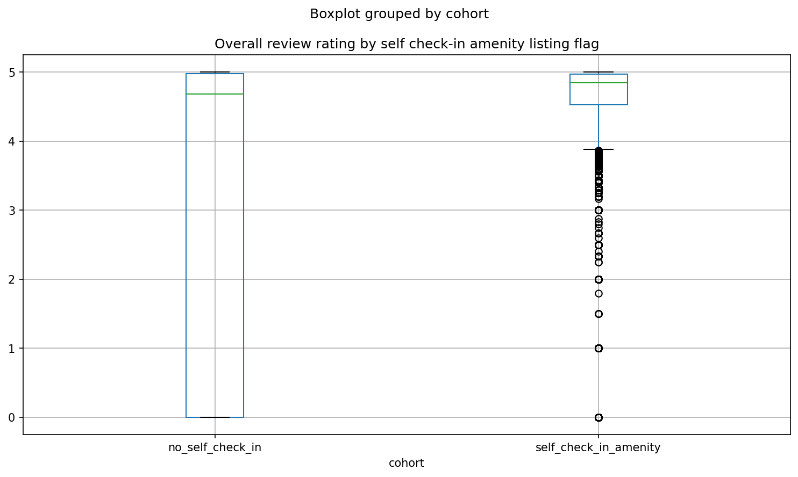

# Block — Guest Experience & Text Analytics (Reviews)

> **Scope:** Unstructured review text + structured listing/review scores (MBA 706).  
> **Last updated:** 2026-04-30  
> **Primary inputs:** `data/processed/reviews_all_cleaned.csv` (chunked reads), `data/processed/master_data.csv` (~103.7k listings with `City` join).  
> **Methodology deep-dive:** `scripts/models/text_analysis/text_analytics_readme.md`.

---

## TL;DR

We turn **multi-GB guest review text** into **listing- and city-level TF–IDF features**, then answer **four guest-experience questions** with a mix of **regex complaint cues**, **Airbnb sub-scores + supervised models (toolkit)**, **amenity-string proxies**, and **TF–IDF deviation / lift** tables. Headline findings: **Hawaii** shows the **highest share of problem-oriented language** in reviews by city; **cleanliness** and **communication** dominate prediction of **overall rating ≥ 4.9**; **lockbox / keypad / cleaning-related amenity mentions** align with **higher mean ratings** in this snapshot (associative only); **top-quartile listings** over-index on **recommend / return-visit** stems in deviation language. Large sparse matrices (`.npz`) and the full deviation CSV are **git-ignored**; regenerate locally after clone.

---

## 1. The questions we are answering

### A. Text mining (hierarchical TF–IDF)

1. What **listing-level themes** stand out vs peers in the **same city** (bag-of-words / TF–IDF)?  
2. What **terms discriminate markets** when each city is one concatenated “mega-document”?  
3. (Optional) What is **average TextBlob polarity** by city when sentiment is **not** skipped?

### B. Guest experience analytics (Q1–Q4)

1. **Q1 — Complaints:** What do guests complain about **in free text**, and does friction differ by **city** or **property type**?  
2. **Q2 — High overall ratings:** Among **cleanliness, check-in, communication, location** sub-scores, which matter most for **overall rating ≥ 4.9**?  
3. **Q3 — Operations:** Do proxies for **self check-in, locks, cleaning, instant book** track with **better review outcomes**?  
4. **Q4 — Top performers:** What **language patterns** distinguish **top-quartile** listings vs others (TF–IDF deviations + lift)?

These connect to the investment narrative (e.g. Block 2 **premium_gap** “watch list” neighborhoods): text and sub-scores help explain *why* guests accept or resist price positioning.

---

## 2. Inputs

| Source | Role |
| --- | --- |
| `data/processed/reviews_all_cleaned.csv` | Review bodies (`comments_clean`), `listing_id`; streamed in **200k-row chunks** for aggregation. |
| `data/processed/master_data.csv` | `id` → `City`; `property_type`, `amenities`, `instant_bookable`, `review_scores_*` for Q2–Q4. |
| `scripts/models/text_analysis/text_mining_core.py` | Loads `master` via **`mba706_toolkit.load_data`** for the listing→city map. |

Only reviews whose `listing_id` maps to the cleaned master listing universe are kept in the text pipeline.

---

## 3. Method

### 3.1 Preprocessing (reviews → tokens)

Aligned with **`text_analytics_readme.md`**:

- **Upstream:** `scripts/cleaning/reviews/run_full_review_cleaning.py` (HTML stripped, normalized text → `comments_clean`).  
- **Vectorizer path:** lowercase / alphanumeric, **English stopwords**, **Porter stemmer** inside a custom `TfidfVectorizer` analyzer.

### 3.2 Hierarchical TF–IDF (`run_hierarchical_text_mining.py`)

**Level 1 — Listing documents**

- One **document** per `listing_id` = concatenation of all `comments_clean` for that listing (only listings in master).  
- **TfidfVectorizer:** `max_features_listing=8000`, `min_df_listing=10`, `max_df_listing=0.85`, **sublinear TF**.  
- Outputs: sparse **listing × term** matrix, vocabulary JSON, row index, listing metadata CSV, **`listing_city_deviation_terms.csv`** (per listing, top **k=15** terms by **z-score vs within-city mean TF–IDF** on active term dimensions).

**Level 2 — City corpora**

- One **pseudo-document** per **City** = concatenate all listing-level text in that city.  
- Separate fit: **`max_features_city=4000`**, `min_df=1`, `max_df=1.0`.  
- Outputs: city matrix `.npz`, city vocabulary, row labels, **`city_corpus_top_terms.csv`** (top TF–IDF terms per city).

**Chunking:** default **`chunksize=200_000`** review rows per read. **`RANDOM_STATE=42`** for optional `--max-listings` subsample.

**Sentiment (optional):** second pass with **TextBlob polarity** aggregated by `City` → `city_sentiment_summary.csv`. Omitted when using **`--skip-sentiment`** (faster; not required for Q1–Q4 as implemented).

### 3.3 Q1 — Complaint cue rate

- **Regex** over `comments_clean` for **problem-oriented cues** (noise, smell, mold, bugs, dirt, broken, delay, disappoint, rude, construction, etc.). **Heat, tight space, and nuisance parties** use **phrases** (e.g. *too hot*, *too small*, *loud party*) so bare tokens like *hot*, *small*, or *party* do not inflate rates from amenities (*hot tub*), contracts (*third party*), or host positioning (*party-friendly*).  
- Join each review to **`City`** and **`property_type`** from master.  
- **Metrics:** `share_complaint_cue` = reviews with ≥1 hit / in-scope reviews, by city and by property type.  
- **Headline property types:** restricted to categories with **≥500 in-scope reviews** to avoid tiny-**n** 100% artefacts.

### 3.4 Q2 — Sub-score drivers of high overall rating

- **Target:** `is_high_overall = 1` iff `review_scores_rating >= 4.9` (listings with non-missing sub-scores).  
- **Features:** `review_scores_cleanliness`, `review_scores_checkin`, `review_scores_communication`, `review_scores_location`.  
- **Toolkit:** `split_data` **70/15/15**, **`train_logistic_regression`**, **`train_random_forest`** (classification).  
- **Interpretation:** coefficients / **feature importance** are **associative** (sub-scores are correlated).

### 3.5 Q3 — Operational proxies

- **Flags** from **`amenities`** string + **`instant_bookable`:** self check-in wording, lockbox/smart lock/keypad, cleaning mentions, host greets, carbon monoxide alarm (parsed as strings).  
- Compare **mean `review_scores_rating`** and **share ≥ 4.9** for flag True vs False.  
- **`create_visualization`** **boxplot:** overall rating vs **self check-in amenity** cohort → **`reports/figures/04_guest_experience/boxplot_cohort.png`** (script moves toolkit output here; see §6).

### 3.6 Q4 — Top-quartile language lift

- **Tier:** listings in **top quartile** of `review_scores_rating` (threshold data-dependent, e.g. ~4.97).  
- Merge listing tiers to **`listing_city_deviation_terms.csv`**.  
- **Lift** (smoothed): \((n_{\text{top}} + 1) / (n_{\text{other}} + 1)\) per **stem** across listing–term rows.

---

## 4. Results

### 4.1 Complaint-oriented language by city (Q1)

| City | Reviews (in scope) | Complaint-cue reviews | Share |
| --- | ---: | ---: | ---: |
| Hawaii | 1,324,881 | 265,916 | **20.1%** |
| New York | 721,102 | 127,232 | 17.6% |
| San Francisco | 348,017 | 55,584 | 16.0% |
| Nashville | 619,421 | 96,395 | 15.6% |
| Los Angeles | 1,427,751 | 216,147 | 15.1% |

**Read:** Hawaii has the **highest** friction-language share in this cue set; ranks are **descriptive** (mix of true pain points, expectations, and segment composition).

**Property type (robust headline):** among types with **≥500** in-scope reviews, **“Room in hotel”** shows the **highest** cue share (~**34%**); full ranks in `q1_complaint_cue_rate_by_property_type.csv`.

**City vocabulary:** `text_features/city_corpus_top_terms.csv` lists **market-discriminating** stems from the city mega-document TF–IDF.

### 4.2 Drivers of overall ≥ 4.9 (Q2)

| Dimension | Logistic coef | RF importance |
| --- | ---: | ---: |
| Cleanliness | 5.18 | **0.43** |
| Communication | 5.01 | 0.26 |
| Check-in | 2.60 | 0.17 |
| Location | 2.35 | 0.14 |

**Read:** **Housekeeping / perceived cleanliness** and **communication** are the strongest levers in this snapshot; test AUC (logistic) ≈ **0.91**. Causal claims are not supported—use for **prioritization** only.

### 4.3 Operational proxies (Q3)

Illustrative flag=True rows (mean overall rating; see full table in CSV):

- **Keypad / lockbox / smart lock:** ~**4.23** mean overall, ~42.9% listings ≥ 4.9.  
- **Cleaning**-related amenity mention: ~**4.15**, ~47.8%.  
- **Self check-in** (wording): ~**4.01**, ~40.9%.  
- **Instant book:** **lower** means in this snapshot (~**3.65**); treat as **segment mix**, not proof Instant Book reduces satisfaction.



### 4.4 Top-quartile language lift (Q4)

Deviation terms that **lift** among top-rated listings (examples—Porter stems): **recommend**, **again**, **friendli**, **experi**, **back**, **great**, **world**, **approach**, **bay**.  

**Read:** language signals **strong endorsement and repeat-stay intent** more than a single amenity keyword; validate qualitatively before templating host messaging.

**Notebook charts:** `guest_experience_charts.ipynb` rebuilds **four visuals** from the Q1–Q4 CSVs for slide-ready support.

---

## 5. Hand-off (Investment memo & other blocks)

| Consumer | Use |
| --- | --- |
| **Block 2 (segments + neighborhoods)** | Pair **Q1 city friction** and **Q2 sub-score gaps** with **oversupplied segments** (e.g. Hawaii cluster 4) to ask whether low occupancy is **ops** vs **product-market fit**. |
| **Block 3 (pricing)** | **Q2** flags where **perceived cleanliness/communication** matter; **Q3** amenity associations can inform **arrival-experience** bundling hypotheses—**not** causal price lift without experiments. |
| **Block 5 (portfolio / risk)** | **`listing_city_deviation_terms`** and Q4 **lift** help short-list **operational playbooks** (cleaning QA, messaging, self check-in hardware) for assets in **premium_gap** “watch” neighborhoods. |

**Join keys:** `listing_id` / master `id`; text features row order in `listing_tfidf_row_index.csv`.

---

## 6. Files

### Data outputs — text features (`results/04_guest_experience/text_features/`)

| File | Purpose |
| --- | --- |
| `listing_tfidf_matrix.npz` | Sparse listing × term TF–IDF (CSR); **large — often git-ignored**. |
| `listing_tfidf_row_index.csv` | Row index ↔ `listing_id` (**gitignored**; regenerate with matrix). |
| `listing_tfidf_vocabulary.json` | Stemmed feature names. |
| `listing_documents_meta.csv` | `listing_id`, `City`, lengths, review counts (**gitignored**; regenerate with matrix). |
| `listing_city_deviation_terms.csv` | Long: listing, city, term, tfidf, z vs city mean; **large — often git-ignored**. |
| `city_corpus_tfidf_matrix.npz` | City-level sparse matrix; **may be git-ignored**. |
| `city_corpus_tfidf_rows.csv` | Row ↔ `City`. |
| `city_corpus_tfidf_vocabulary.json` | City corpus vocab. |
| `city_corpus_top_terms.csv` | Top terms per city (tracked). |
| `city_sentiment_summary.csv` | Mean polarity by city (only if sentiment pass run). |
| `README.md` | Artefact index. |

### Data outputs — Q1–Q4 (`results/04_guest_experience/`)

| Path | Purpose |
| --- | --- |
| `q1_review_complaints/q1_*.csv`, `q1_summary.md` | Complaint cue rates. |
| `q2_five_star_drivers/q2_*.csv`, `q2_summary.md` | Model + correlation evidence. |
| `q3_operational_investments/q3_*.csv`, `q3_summary.md` | Amenity / instant-book associations. |
| `q4_top_performer_praise/q4_*.csv`, `q4_summary.md` | Term lift table. |
| `04_guest_experience.txt` | Plain-text synthesis of Q1–Q4. |

### Figures (`reports/figures/04_guest_experience/`)

| File | Purpose |
| --- | --- |
| `boxplot_cohort.png` | Q3: overall rating by self check-in amenity cohort (`create_visualization` from `run_guest_experience_questions.py`; moved here after generation). |
| `q1_complaint_cue_rate_by_city.png` | Q1: complaint cue rate by city (`guest_experience_charts.ipynb`). |
| `q2_subscore_drivers_rf_logistic.png` | Q2: RF importance + logistic coefficients (`guest_experience_charts.ipynb`). |
| `q3_operational_signals_mean_rating.png` | Q3: mean overall rating by operational flags (`guest_experience_charts.ipynb`). |
| `q4_term_lift_top_performers.png` | Q4: term lift for top-quartile listings (`guest_experience_charts.ipynb`). |

### Scripts

| Script | Role |
| --- | --- |
| `scripts/models/text_analysis/run_hierarchical_text_mining.py` | Chunked aggregation + TF–IDF + optional sentiment. |
| `scripts/models/text_analysis/text_mining_core.py` | Pipeline implementation. |
| `scripts/models/text_analysis/text_preprocessing.py` | Stemming / analyzer. |
| `scripts/04_guest_experience/run_guest_experience_questions.py` | Rebuilds Q1–Q4 tables and markdown (toolkit splits + models). |
| `results/04_guest_experience/guest_experience_charts.ipynb` | Four charts from saved CSVs; saves matching PNGs under `reports/figures/04_guest_experience/` when executed. |

---

## 7. Reproduction

**Text features** (full run; omit `--skip-sentiment` if you need `city_sentiment_summary.csv`):

```powershell
python scripts/models/text_analysis/run_hierarchical_text_mining.py --skip-sentiment
```

**Guest experience Q1–Q4** (requires reviews + master; Q4 needs deviation file from step above — see **Reproducibility** in `q4_top_performer_praise/q4_summary.md` if you only clone the repo):

```powershell
python scripts/04_guest_experience/run_guest_experience_questions.py
```

Runtime for text mining is **tens of minutes** on a laptop (full review scan + large `fit_transform`). All paths are project-root–relative.
